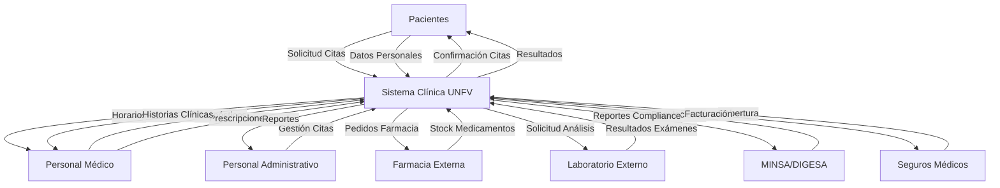

# Diagrama de Contexto - Clínica UNFV

## Descripción
El diagrama de contexto muestra el sistema de la Clínica UNFV y sus interacciones con las entidades externas.

## Entidades Externas:
- **Pacientes**: Solicitan citas, consultas y servicios
- **Personal Médico**: Doctores, enfermeras, especialistas
- **Personal Administrativo**: Recepcionistas, administradores
- **Farmacia Externa**: Proveedores de medicamentos
- **Laboratorio Externo**: Servicios de análisis clínicos
- **MINSA/DIGESA**: Entidades reguladoras
- **Seguros Médicos**: EPS, SIS, seguros privados

## Flujos de Información:

### Entrada al Sistema:
- Solicitudes de cita (Web/Presencial)
- Datos del paciente
- Resultados de laboratorio
- Información de seguros
- Regulaciones sanitarias
- Inventario de medicamentos

### Salida del Sistema:
- Confirmación de citas
- Historias clínicas
- Recetas médicas
- Reportes médicos
- Facturación
- Estadísticas de atención

## Límites del Sistema:
- **Dentro**: Gestión de citas, historias clínicas, farmacia interna, diagnóstico por imágenes
- **Fuera**: Laboratorios externos, seguros médicos, proveedores farmacéuticos