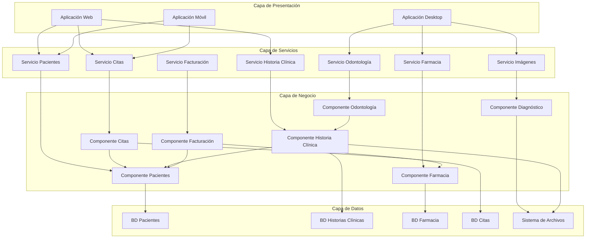

# Diagrama de Componentes - Clínica UNFV

## Descripción
El diagrama de componentes muestra la arquitectura interna del sistema de la Clínica UNFV y las interfaces entre componentes.

## Componentes Principales:

### 1. Componente de Gestión de Pacientes
- **Responsabilidad**: Registro y gestión de datos de pacientes
- **Interfaces**: IPaciente, IHistoriaClinica
- **Dependencias**: Base de Datos Pacientes

### 2. Componente de Gestión de Citas
- **Responsabilidad**: Programación y control de citas
- **Interfaces**: ICita, IHorario
- **Dependencias**: Componente Pacientes, Componente Personal Médico

### 3. Componente de Historia Clínica
- **Responsabilidad**: Almacenamiento y gestión de historias médicas
- **Interfaces**: IHistoriaClinica, IArchivo
- **Dependencias**: Base de Datos Historias, Sistema de Archivos

### 4. Componente de Farmacia
- **Responsabilidad**: Gestión de medicamentos e inventario
- **Interfaces**: IFarmacia, IInventario
- **Dependencias**: Base de Datos Inventario

### 5. Componente de Diagnóstico por Imágenes
- **Responsabilidad**: Gestión de estudios médicos
- **Interfaces**: IImagenes, IEstudio
- **Dependencias**: Sistema de Archivos Imágenes

### 6. Componente de Odontología
- **Responsabilidad**: Gestión especializada dental
- **Interfaces**: IOdontologia, ITratamiento
- **Dependencias**: Componente Historia Clínica

### 7. Componente de Facturación
- **Responsabilidad**: Gestión de pagos y seguros
- **Interfaces**: IFacturacion, IPago
- **Dependencias**: Componente Seguros



## Interfaces Principales:

### IPaciente
```java
interface IPaciente {
    void registrarPaciente(DatosPaciente datos);
    Paciente buscarPaciente(String dni);
    void actualizarPaciente(Paciente paciente);
    List<Paciente> listarPacientes();
}
```

### ICita
```java
interface ICita {
    void programarCita(Cita cita);
    void cancelarCita(String idCita);
    List<Cita> consultarCitasPaciente(String dniPaciente);
    List<Cita> consultarCitasMedico(String idMedico);
}
```

### IHistoriaClinica
```java
interface IHistoriaClinica {
    void crearHistoria(String dniPaciente);
    void agregarConsulta(ConsultaMedica consulta);
    HistoriaClinica obtenerHistoria(String dniPaciente);
    void archivarHistoria(String numeroHistoria);
}
```

## Patrones Aplicados:
- **Repository Pattern**: Para acceso a datos
- **Service Layer**: Para lógica de negocio
- **Dependency Injection**: Para desacoplamiento
- **Factory Pattern**: Para creación de objetos
- **Observer Pattern**: Para notificaciones