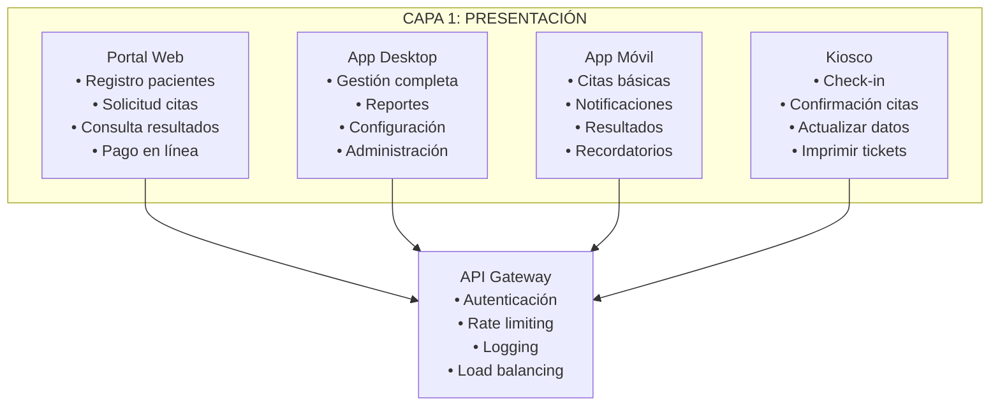
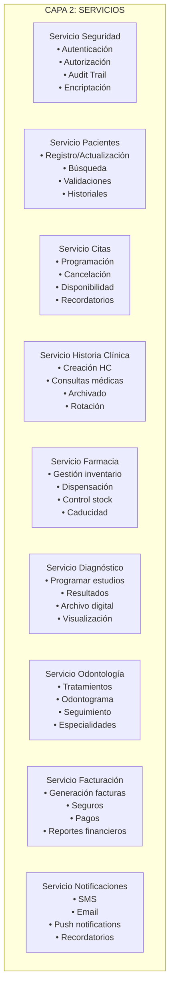
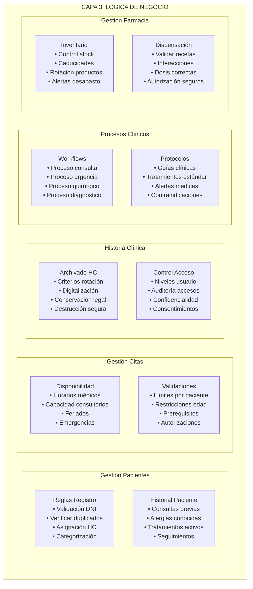
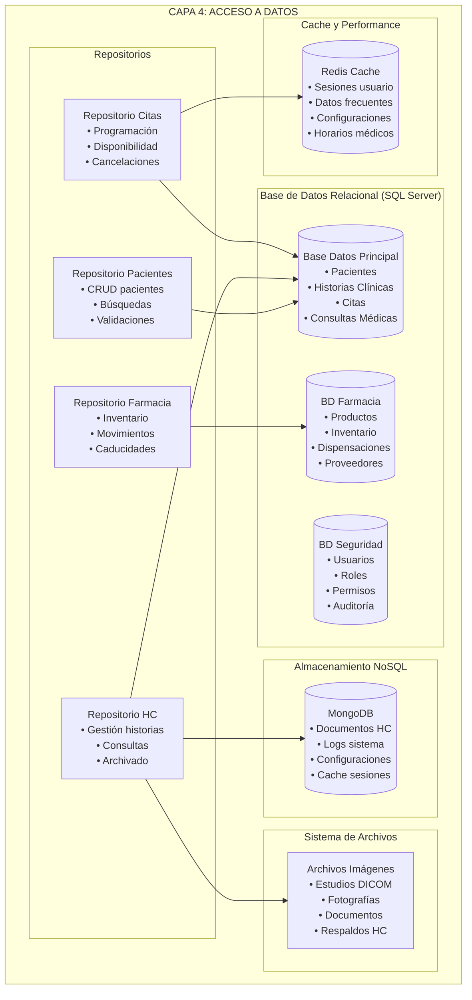
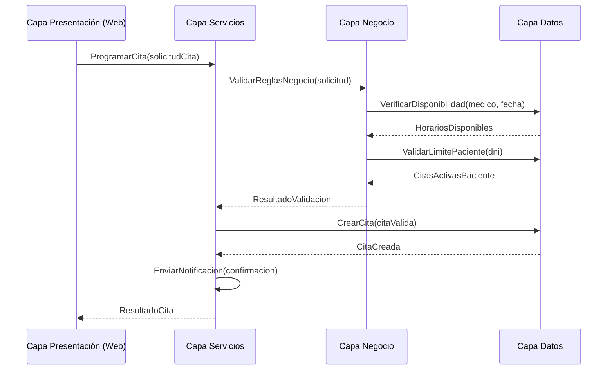
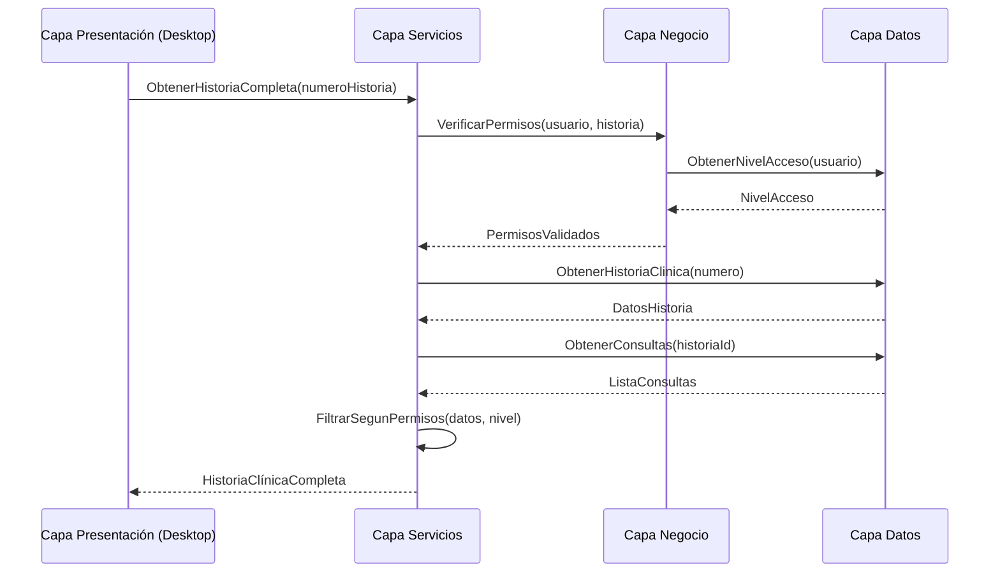

# Modelo de 4 Capas - Clínica UNFV

## Descripción
Arquitectura de 4 capas que implementa el patrón de separación de responsabilidades para el sistema de la Clínica UNFV.

## CAPA 1: PRESENTACIÓN (Presentation Layer)

### Responsabilidades:
- Interfaz de usuario
- Validación de entrada
- Formateo de salida
- Navegación entre pantallas

### Componentes:
- **Portal Web**: Citas online, consulta de resultados
- **Aplicación Desktop**: Gestión administrativa completa
- **Aplicación Móvil**: Consultas básicas y notificaciones
- **Kioscos de Autoservicio**: Check-in de pacientes

### Tecnologías:
- **Web**: React/Angular + Bootstrap
- **Desktop**: WPF/.NET o JavaFX
- **Móvil**: React Native o Flutter
- **API Gateway**: Para unificar servicios



## CAPA 2: SERVICIOS (Service Layer)

### Responsabilidades:
- Lógica de aplicación
- Coordinación entre componentes
- Transacciones
- Seguridad y autorización

### Servicios Principales:

#### Servicio de Gestión de Pacientes
```csharp
public class ServicioPacientes
{
    public async Task<ResultadoOperacion> RegistrarPaciente(DatosPaciente datos)
    public async Task<Paciente> ObtenerPaciente(string dni)
    public async Task<List<Paciente>> BuscarPacientes(CriteriosBusqueda criterios)
    public async Task<bool> ActualizarDatos(string dni, DatosPaciente nuevosDatos)
}
```

#### Servicio de Gestión de Citas
```csharp
public class ServicioCitas
{
    public async Task<CitaCreada> ProgramarCita(SolicitudCita solicitud)
    public async Task<bool> CancelarCita(string idCita, string motivo)
    public async Task<List<Cita>> ObtenerCitasPaciente(string dni, DateTime desde, DateTime hasta)
    public async Task<DisponibilidadMedico> ConsultarDisponibilidad(string idMedico, DateTime fecha)
}
```

#### Servicio de Historia Clínica
```csharp
public class ServicioHistoriaClinica
{
    public async Task<string> CrearNuevaHistoria(string dniPaciente)
    public async Task<bool> RegistrarConsulta(ConsultaMedica consulta)
    public async Task<HistoriaCompleta> ObtenerHistoriaCompleta(string numeroHistoria)
    public async Task<bool> ArchivarHistoria(string numeroHistoria, MotivoArchivo motivo)
}
```



## CAPA 3: LÓGICA DE NEGOCIO (Business Logic Layer)

### Responsabilidades:
- Reglas de negocio
- Validaciones complejas
- Algoritmos específicos del dominio
- Workflows y procesos

### Módulos de Negocio:

#### Gestión de Pacientes
```csharp
public class GestorPacientes
{
    public bool ValidarDatosPaciente(DatosPaciente datos)
    {
        // Validar DNI peruano
        // Verificar edad mínima
        // Validar email y teléfono
        // Verificar duplicados
    }
    
    public string GenerarNumeroHistoriaClinica(string dni)
    {
        // Algoritmo: YYYY + Código Sede + Número Secuencial
        // Ejemplo: 2024-UNFV-001234
    }
}
```

#### Gestión de Citas
```csharp
public class GestorCitas
{
    public List<HorarioDisponible> CalcularDisponibilidad(
        string especialidad, 
        DateTime fechaInicio, 
        DateTime fechaFin)
    {
        // Considerar horarios de médicos
        // Considerar feriados
        // Considerar disponibilidad de consultorios
        // Aplicar reglas de spacing entre citas
    }
    
    public bool ValidarReglasNegocioCita(SolicitudCita solicitud)
    {
        // Máximo 3 citas pendientes por paciente
        // No más de 1 cita por especialidad por mes
        // Verificar restricciones de edad para especialidades
    }
}
```

#### Gestión de Historia Clínica
```csharp
public class GestorHistoriaClinica
{
    public bool RequiereRotacionFisica(HistoriaClinica historia)
    {
        // Historias > 5 años sin actividad
        // Espacio de archivo físico limitado
        // Pacientes fallecidos (después de período legal)
    }
    
    public NivelAccesoHistoria DeterminarNivelAcceso(
        Usuario usuario, 
        HistoriaClinica historia)
    {
        // Médico tratante: Acceso completo
        // Médico consultor: Solo lectura
        // Enfermería: Acceso limitado
        // Administrativo: Solo datos demográficos
    }
}
```



## CAPA 4: ACCESO A DATOS (Data Access Layer)

### Responsabilidades:
- Persistencia de datos
- Consultas optimizadas
- Transacciones de base de datos
- Cache y performance

### Repositorios y Entidades:

#### Base de Datos Principal
```sql
-- Esquema principal de la base de datos

-- Tabla Pacientes
CREATE TABLE Pacientes (
    PacienteID UNIQUEIDENTIFIER PRIMARY KEY DEFAULT NEWID(),
    DNI VARCHAR(8) UNIQUE NOT NULL,
    Nombres NVARCHAR(100) NOT NULL,
    ApellidoPaterno NVARCHAR(50) NOT NULL,
    ApellidoMaterno NVARCHAR(50),
    FechaNacimiento DATE NOT NULL,
    Sexo CHAR(1) CHECK (Sexo IN ('M', 'F')),
    Telefono VARCHAR(15),
    Email NVARCHAR(100),
    Direccion NVARCHAR(200),
    TipoSeguro NVARCHAR(50),
    NumeroSeguro NVARCHAR(20),
    FechaRegistro DATETIME2 DEFAULT GETDATE(),
    EstadoCivil NVARCHAR(20),
    Ocupacion NVARCHAR(100),
    ContactoEmergencia NVARCHAR(100),
    TelefonoEmergencia VARCHAR(15),
    Activo BIT DEFAULT 1,
    INDEX IX_Pacientes_DNI (DNI),
    INDEX IX_Pacientes_Nombres (Nombres, ApellidoPaterno)
);

-- Tabla Historias Clínicas
CREATE TABLE HistoriasClinicas (
    HistoriaID UNIQUEIDENTIFIER PRIMARY KEY DEFAULT NEWID(),
    NumeroHistoria VARCHAR(20) UNIQUE NOT NULL,
    PacienteID UNIQUEIDENTIFIER NOT NULL,
    FechaApertura DATETIME2 DEFAULT GETDATE(),
    EstadoArchivo NVARCHAR(20) DEFAULT 'ACTIVA',
    UbicacionFisica NVARCHAR(100),
    UltimaRotacion DATETIME2,
    MotivoRotacion NVARCHAR(200),
    DigitalizacionCompleta BIT DEFAULT 0,
    FOREIGN KEY (PacienteID) REFERENCES Pacientes(PacienteID),
    INDEX IX_HistoriasClinicas_Numero (NumeroHistoria),
    INDEX IX_HistoriasClinicas_Paciente (PacienteID)
);

-- Tabla Citas
CREATE TABLE Citas (
    CitaID UNIQUEIDENTIFIER PRIMARY KEY DEFAULT NEWID(),
    PacienteID UNIQUEIDENTIFIER NOT NULL,
    MedicoID UNIQUEIDENTIFIER NOT NULL,
    ConsultorioID UNIQUEIDENTIFIER NOT NULL,
    FechaCita DATETIME2 NOT NULL,
    TipoCita NVARCHAR(30) NOT NULL, -- CONSULTA_EXTERNA, URGENCIA, CONTROL, ESPECIALIZAD
    EspecialidadID UNIQUEIDENTIFIER NOT NULL,
    EstadoCita NVARCHAR(20) DEFAULT 'PROGRAMADA', -- PROGRAMADA, CONFIRMADA, ATENDIDA, CANCELADA, NO_ASISTIO
    MotivoConsulta NVARCHAR(500),
    ObservacionesCita NVARCHAR(1000),
    FechaCreacion DATETIME2 DEFAULT GETDATE(),
    CreadoPor UNIQUEIDENTIFIER NOT NULL,
    FechaCancelacion DATETIME2,
    MotivoCancelacion NVARCHAR(200),
    FOREIGN KEY (PacienteID) REFERENCES Pacientes(PacienteID),
    INDEX IX_Citas_Fecha (FechaCita),
    INDEX IX_Citas_Paciente (PacienteID),
    INDEX IX_Citas_Medico (MedicoID)
);

-- Tabla Consultas Médicas
CREATE TABLE ConsultasMedicas (
    ConsultaID UNIQUEIDENTIFIER PRIMARY KEY DEFAULT NEWID(),
    CitaID UNIQUEIDENTIFIER NOT NULL,
    HistoriaID UNIQUEIDENTIFIER NOT NULL,
    FechaConsulta DATETIME2 DEFAULT GETDATE(),
    MotivoConsulta NVARCHAR(1000),
    Anamnesis NVARCHAR(MAX),
    ExamenFisico NVARCHAR(MAX),
    Diagnostico NVARCHAR(MAX),
    TratamientoIndicado NVARCHAR(MAX),
    ObservacionesConsulta NVARCHAR(MAX),
    ProximaConsulta DATETIME2,
    MedicoResponsable UNIQUEIDENTIFIER NOT NULL,
    FOREIGN KEY (CitaID) REFERENCES Citas(CitaID),
    FOREIGN KEY (HistoriaID) REFERENCES HistoriasClinicas(HistoriaID)
);

-- Tabla Farmacia
CREATE TABLE ProductosFarmacia (
    ProductoID UNIQUEIDENTIFIER PRIMARY KEY DEFAULT NEWID(),
    CodigoProducto VARCHAR(20) UNIQUE NOT NULL,
    NombreComercial NVARCHAR(200) NOT NULL,
    NombreGenerico NVARCHAR(200),
    Concentracion NVARCHAR(50),
    FormaFarmaceutica NVARCHAR(100),
    Laboratorio NVARCHAR(100),
    StockActual INT DEFAULT 0,
    StockMinimo INT DEFAULT 10,
    PrecioUnitario DECIMAL(10,2),
    FechaCaducidad DATE,
    Activo BIT DEFAULT 1,
    RequiereReceta BIT DEFAULT 1,
    INDEX IX_ProductosFarmacia_Codigo (CodigoProducto),
    INDEX IX_ProductosFarmacia_Nombre (NombreComercial)
);

-- Tabla Diagnóstico por Imágenes
CREATE TABLE EstudiosImagenes (
    EstudioID UNIQUEIDENTIFIER PRIMARY KEY DEFAULT NEWID(),
    ConsultaID UNIQUEIDENTIFIER NOT NULL,
    TipoEstudio NVARCHAR(100) NOT NULL, -- RADIOGRAFIA, ECOGRAFIA, TAC, RMN, etc.
    AreaAnatomica NVARCHAR(100),
    IndicacionMedica NVARCHAR(500),
    FechaSolicitud DATETIME2 DEFAULT GETDATE(),
    FechaProgramada DATETIME2,
    FechaRealizacion DATETIME2,
    ResultadoEstudio NVARCHAR(MAX),
    ArchivosDigitales NVARCHAR(500), -- Rutas de archivos DICOM
    MedicoSolicitante UNIQUEIDENTIFIER NOT NULL,
    RadiologoInformante UNIQUEIDENTIFIER,
    EstadoEstudio NVARCHAR(20) DEFAULT 'SOLICITADO',
    FOREIGN KEY (ConsultaID) REFERENCES ConsultasMedicas(ConsultaID)
);

-- Tabla Odontología
CREATE TABLE ConsultasOdontologia (
    ConsultaOdontoID UNIQUEIDENTIFIER PRIMARY KEY DEFAULT NEWID(),
    ConsultaID UNIQUEIDENTIFIER NOT NULL,
    Odontograma NVARCHAR(MAX), -- JSON con estado de cada pieza dental
    TratamientosRealizados NVARCHAR(MAX),
    TratamientosProgramados NVARCHAR(MAX),
    ObservacionesOdonto NVARCHAR(1000),
    ProximaConsultaOdonto DATETIME2,
    FOREIGN KEY (ConsultaID) REFERENCES ConsultasMedicas(ConsultaID)
);
```

#### Repositorios
```csharp
public interface IRepositorioPacientes
{
    Task<Paciente> ObtenerPorDni(string dni);
    Task<Paciente> ObtenerPorId(Guid pacienteId);
    Task<List<Paciente>> BuscarPacientes(CriteriosBusqueda criterios);
    Task<Guid> CrearPaciente(Paciente paciente);
    Task<bool> ActualizarPaciente(Paciente paciente);
    Task<bool> DesactivarPaciente(Guid pacienteId);
}

public interface IRepositorioHistoriasClinicas
{
    Task<HistoriaClinica> ObtenerPorNumero(string numeroHistoria);
    Task<HistoriaClinica> ObtenerPorPaciente(Guid pacienteId);
    Task<string> CrearHistoriaClinica(Guid pacienteId);
    Task<bool> RegistrarConsulta(ConsultaMedica consulta);
    Task<List<HistoriaClinica>> ObtenerHistoriasParaRotacion();
    Task<bool> MarcarComoRotada(string numeroHistoria, string ubicacion);
}

public interface IRepositorioCitas
{
    Task<List<Cita>> ObtenerCitasPaciente(Guid pacienteId, DateTime desde, DateTime hasta);
    Task<List<Cita>> ObtenerCitasMedico(Guid medicoId, DateTime fecha);
    Task<Guid> CrearCita(Cita cita);
    Task<bool> CancelarCita(Guid citaId, string motivo);
    Task<bool> ConfirmarCita(Guid citaId);
    Task<List<HorarioDisponible>> ObtenerDisponibilidad(Guid medicoId, DateTime fecha);
}
```



## Flujo de Datos Entre Capas

### Ejemplo: Programar una Cita


### Ejemplo: Consultar Historia Clínica


## Tecnologías por Capa

### Capa 1: Presentación
- **Frontend Web**: React 18 + TypeScript + Bootstrap 5
- **API Gateway**: Kong o Azure API Management
- **Autenticación**: JWT + OAuth 2.0
- **Mobile**: React Native o Flutter

### Capa 2: Servicios
- **Framework**: .NET 8 o Spring Boot 3
- **API**: RESTful + GraphQL
- **Documentación**: Swagger/OpenAPI
- **Containerización**: Docker + Kubernetes

### Capa 3: Lógica de Negocio
- **Patrones**: Domain-Driven Design (DDD)
- **Validación**: FluentValidation
- **Workflow**: MassTransit + RabbitMQ
- **Rules Engine**: Microsoft Rules Engine

### Capa 4: Acceso a Datos
- **BD Principal**: SQL Server 2022
- **ORM**: Entity Framework Core
- **Cache**: Redis
- **NoSQL**: MongoDB para documentos
- **Archivos**: Azure Blob Storage o MinIO