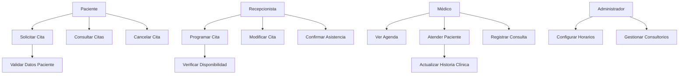
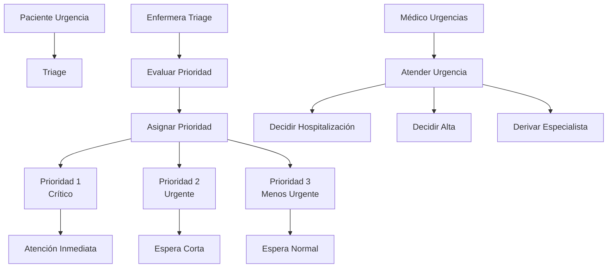
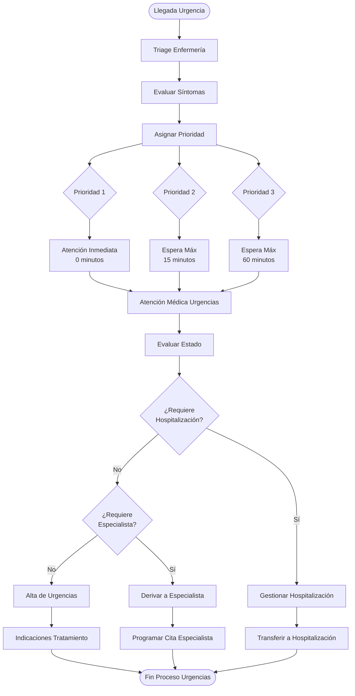
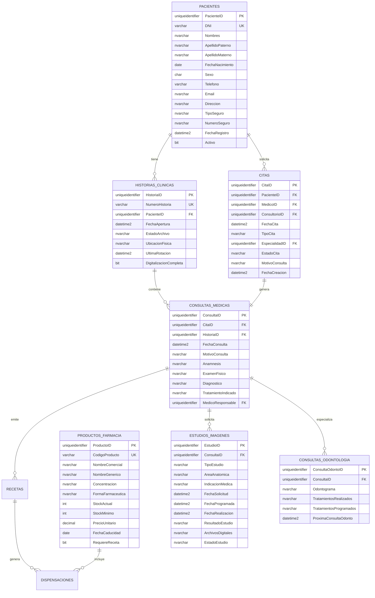
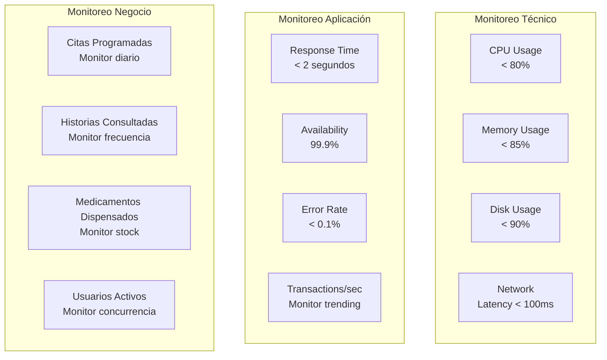

# Especificaciones Técnicas Adicionales - Clínica UNFV

## 1. Diagramas de Casos de Uso Específicos

### Caso de Uso: Gestión de Citas por Consultorio Externo

### Caso de Uso: Atención por Urgencias

## 2. Matriz de Responsabilidades RACI

| Proceso | Paciente | Recepcionista | Médico | Enfermera | Administrador | Farmacéutico |
|---------|----------|---------------|--------|-----------|---------------|--------------|
| Solicitar Cita Web | R | I | I | - | - | - |
| Programar Cita Presencial | C | R | C | - | A | - |
| Confirmar Asistencia | R | A | I | - | - | - |
| Registrar Consulta | I | I | R | C | - | - |
| Actualizar Historia Clínica | I | I | R | C | A | - |
| Dispensar Medicamentos | I | I | C | I | I | R |
| Programar Estudios | I | C | R | I | I | - |
| Gestionar Inventario | - | I | I | - | C | R |
| Generar Reportes | - | I | I | - | R | I |

**Leyenda**: R=Responsable, A=Accountable, C=Consultado, I=Informado

## 3. Flujos de Trabajo Detallados

### Workflow: Proceso Completo de Consulta Externa

```mermaid
flowchart TD
    START([Inicio]) --> REG_PAC{¿Paciente<br/>Registrado?}
    
    REG_PAC -->|No| CREAR_PAC[Crear Nuevo Paciente]
    CREAR_PAC --> GEN_HC[Generar Historia Clínica]
    GEN_HC --> SOL_CITA[Solicitar Cita]
    
    REG_PAC -->|Sí| SOL_CITA
    SOL_CITA --> VER_DISP[Verificar Disponibilidad]
    VER_DISP --> DISP_OK{¿Disponible?}
    
    DISP_OK -->|No| PROP_ALT[Proponer Alternativas]
    PROP_ALT --> ACEP_ALT{¿Acepta?}
    ACEP_ALT -->|No| END([Fin])
    ACEP_ALT -->|Sí| CREAR_CITA
    
    DISP_OK -->|Sí| CREAR_CITA[Crear Cita]
    CREAR_CITA --> ENVIAR_CONF[Enviar Confirmación]
    ENVIAR_CONF --> ESP_CITA[Esperar Fecha Cita]
    
    ESP_CITA --> FECHA_CITA[Fecha de Cita]
    FECHA_CITA --> CHECK_IN[Check-in Paciente]
    CHECK_IN --> ESP_ATEN[Esperar Atención]
    ESP_ATEN --> ATEN_MED[Atención Médica]
    
    ATEN_MED --> REG_CONS[Registrar Consulta]
    REG_CONS --> NECES_EST{¿Necesita<br/>Estudios?}
    
    NECES_EST -->|Sí| PROG_EST[Programar Estudios]
    PROG_EST --> NECES_MED
    
    NECES_EST -->|No| NECES_MED{¿Necesita<br/>Medicamentos?}
    
    NECES_MED -->|Sí| DISP_MED[Dispensar Medicamentos]
    DISP_MED --> PROG_SEG
    
    NECES_MED -->|No| PROG_SEG{¿Programar<br/>Seguimiento?}
    
    PROG_SEG -->|Sí| PROG_CITA_SEG[Programar Cita Seguimiento]
    PROG_CITA_SEG --> FIN_PROC
    
    PROG_SEG -->|No| FIN_PROC[Finalizar Proceso]
    FIN_PROC --> END
```

### Workflow: Proceso de Urgencias

## 4. Modelo de Datos Extendido

### Diagrama Entidad-Relación Completo

## 5. Seguridad y Compliance

### Matriz de Seguridad
| Componente | Amenaza | Control | Implementación |
|------------|---------|---------|----------------|
| Autenticación | Acceso no autorizado | Multi-factor Authentication | Azure AD + SMS |
| Autorización | Escalación privilegios | Role-Based Access Control | Claims-based security |
| Datos HC | Acceso no autorizado | Cifrado + Auditoría | AES-256 + Logs detallados |
| Comunicación | Interceptación | Cifrado en tránsito | TLS 1.3 |
| Base Datos | Inyección SQL | Prepared statements | Entity Framework |
| Archivos Médicos | Acceso no autorizado | Cifrado archivos | Azure Key Vault |

### Cumplimiento Normativo Peruano
- **Ley N° 29733**: Ley de Protección de Datos Personales
- **Ley N° 26842**: Ley General de Salud
- **Norma Técnica N° 022-MINSA/DGSP-V.02**: Historia Clínica
- **Resolución Ministerial N° 518-2015/MINSA**: Telemedicina

## 6. Métricas y Monitoreo

### KPIs del Sistema
| Métrica | Objetivo | Medición |
|---------|----------|----------|
| Tiempo respuesta promedio | < 2 segundos | APM tools |
| Disponibilidad sistema | 99.9% | Uptime monitoring |
| Tiempo programación cita | < 5 minutos | User analytics |
| Satisfacción usuario | > 4.5/5 | Encuestas |
| Errores sistema | < 0.1% | Error tracking |
| Tiempo recuperación HC | < 30 segundos | Performance monitoring |

### Dashboard de Monitoreo

## 7. Plan de Implementación

### Fases de Desarrollo
1. **Fase 1 (3 meses)**: Módulo Pacientes + Citas Básicas
2. **Fase 2 (2 meses)**: Historia Clínica + Consultas Médicas
3. **Fase 3 (2 meses)**: Farmacia + Inventario
4. **Fase 4 (2 meses)**: Diagnóstico por Imágenes
5. **Fase 5 (1 mes)**: Odontología + Especialidades
6. **Fase 6 (1 mes)**: Optimización + Go Live

### Tecnologías Recomendadas por Presupuesto

#### Opción Económica (< $50,000)
- **Backend**: .NET Core + PostgreSQL
- **Frontend**: React + Bootstrap
- **Hosting**: Azure App Service Basic
- **Storage**: Azure Blob Storage

#### Opción Estándar ($50,000 - $150,000)
- **Backend**: .NET 8 + SQL Server Standard
- **Frontend**: React + Material UI
- **Hosting**: Azure App Service Standard + Redis
- **Storage**: Azure Premium Storage

#### Opción Enterprise (> $150,000)
- **Backend**: Microservicios + SQL Server Enterprise
- **Frontend**: React + Custom UI
- **Hosting**: Azure Kubernetes Service
- **Storage**: Azure Premium + CDN