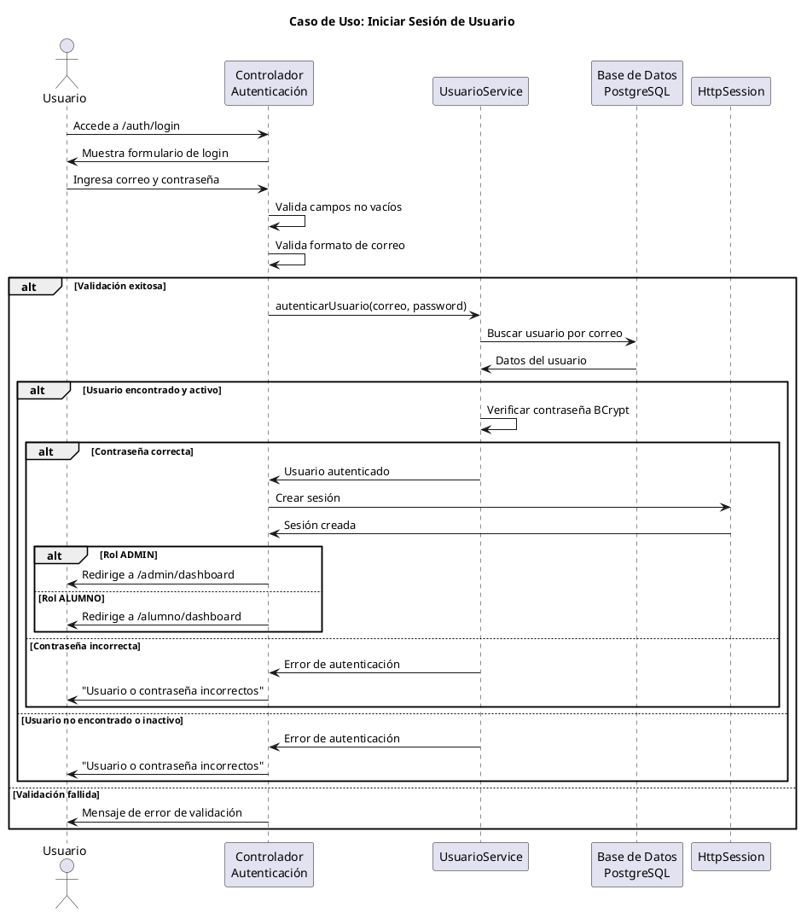

# Caso de Uso: Iniciar Sesión de Usuario
## Referencias
RF1.1, RF1.1.1, RF1.1.2, RF1.1.3, RF1.1.4

## Actores
Administrador, Estudiante

## Tipo
Primario

## Propósito
Permitir que los usuarios autorizados ingresen al sistema mediante credenciales válidas para acceder a sus funcionalidades específicas según su rol.

## Resumen
El usuario ingresa su correo electrónico y contraseña en el formulario de login. El sistema valida que los campos no estén vacíos, verifica la existencia del usuario en la base de datos PostgreSQL y valida la contraseña encriptada con BCrypt. Si las credenciales son válidas, el sistema crea una sesión segura y redirige al usuario al dashboard correspondiente según su rol (Administrador al panel admin, Estudiante al portal estudiantil).

## CURSO NORMAL DE EVENTOS

| Acción del Actor | Respuesta del Sistema |
|------------------|----------------------|
| 1. El caso de uso comienza cuando el usuario accede a la URL del sistema de biblioteca. | 2. El sistema muestra el formulario de inicio de sesión con campos para correo y contraseña. |
| 3. El usuario ingresa su correo electrónico y contraseña. | 4a. El sistema valida que los campos no estén vacíos y que el correo tenga formato válido. |
| 5. El usuario hace clic en "Iniciar Sesión". | 6a. El sistema verifica que el usuario exista en la base de datos. |
| | 7a. El sistema valida que la contraseña ingresada coincida con el hash BCrypt almacenado. |
| | 8a. El sistema verifica que la cuenta de usuario esté activa. |
| | 9. El sistema crea una sesión HTTP segura para el usuario autenticado. |
| | 10. El sistema redirige al usuario según su rol: /admin/dashboard para ADMIN o /alumno/dashboard para ALUMNO. |

## CURSOS ALTERNATIVOS

**4b.** Si algún campo está vacío o el correo no tiene formato válido, el sistema muestra un mensaje de error y solicita corregir la información.

**6b.** Si el correo no existe en la base de datos, el sistema muestra el mensaje "Usuario o contraseña incorrectos" y vuelve al paso 2.

**7b.** Si la contraseña es incorrecta, el sistema muestra el mensaje "Usuario o contraseña incorrectos" y vuelve al paso 2.

**8b.** Si la cuenta está inactiva, el sistema muestra "Cuenta inactiva. Contacte al administrador" y vuelve al paso 2.

## Diagrama PlantUML

## Precondiciones
- El sistema debe estar ejecutándose y accesible
- La base de datos PostgreSQL debe estar disponible
- El usuario debe tener credenciales válidas registradas en el sistema

## Postcondiciones
- **Éxito**: El usuario queda autenticado con una sesión activa y accede a su dashboard correspondiente
- **Fallo**: El usuario permanece en la página de login con mensaje de error apropiado

## Reglas de Negocio
- **RN1**: Las contraseñas se almacenan encriptadas usando BCrypt
- **RN2**: Las sesiones tienen timeout automático de 30 minutos
- **RN3**: Solo usuarios con estado "activo" pueden iniciar sesión
- **RN4**: El sistema distingue entre roles ADMIN y ALUMNO para redirección
- **RN5**: Los intentos fallidos de login son registrados para auditoría