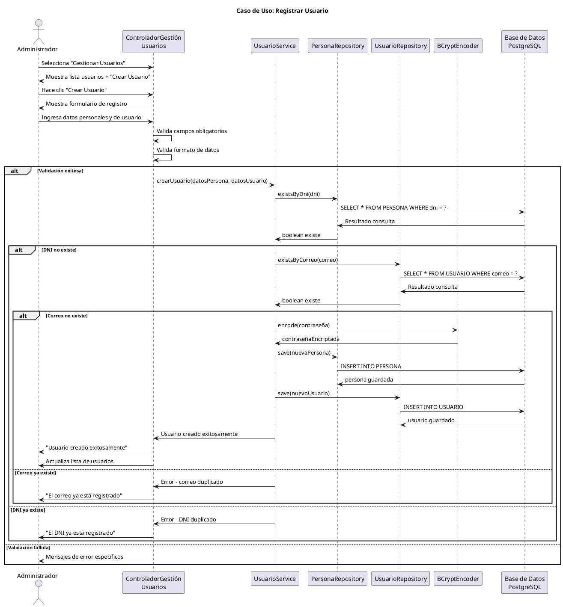

# Caso de Uso: Registrar Usuario
## Referencias
RF2.1, RF2.1.1, RF2.1.2, RF2.1.3, RF2.1.4, RF2.1.5

## Actores
Administrador

## Tipo
Primario

## Propósito
Permitir al administrador registrar un nuevo usuario (ADMIN o ALUMNO) en el sistema, creando tanto el registro de usuario como la información personal asociada.

## Resumen
El administrador accede al módulo de gestión de usuarios y selecciona crear nuevo usuario. Ingresa los datos personales (nombres, apellidos, DNI, dirección, teléfono) y los datos de acceso (correo, contraseña, rol). El sistema valida que el correo y DNI sean únicos, encripta la contraseña usando BCrypt, crea el registro de persona y usuario asociado, y confirma la operación exitosa.

## CURSO NORMAL DE EVENTOS

| Acción del Actor | Respuesta del Sistema |
|------------------|----------------------|
| 1. El caso de uso comienza cuando el administrador selecciona "Gestionar Usuarios" desde el dashboard. | 2. El sistema muestra la lista de usuarios existentes y la opción "Crear Usuario". |
| 3. El administrador hace clic en "Crear Usuario". | 4. El sistema despliega el formulario de registro con campos para datos personales y de usuario. |
| 5. El administrador ingresa: nombres, apellidos, DNI, dirección, teléfono, correo, contraseña y selecciona el rol (ADMIN/ALUMNO). | 6a. El sistema valida que todos los campos obligatorios estén completos y con formato correcto. |
| | 7a. El sistema verifica que el correo electrónico no exista en la base de datos. |
| | 8a. El sistema verifica que el DNI no esté registrado para otra persona. |
| 9. El administrador confirma el registro haciendo clic en "Guardar Usuario". | 10a. El sistema encripta la contraseña usando BCrypt. |
| | 11. El sistema crea el registro en la tabla PERSONA con los datos personales. |
| | 12. El sistema crea el registro en la tabla USUARIO asociado a la persona, con estado activo. |
| | 13. El sistema muestra mensaje de confirmación "Usuario creado exitosamente" y actualiza la lista de usuarios. |

## CURSOS ALTERNATIVOS

**6b.** Si algún campo obligatorio está vacío o tiene formato incorrecto:
- El sistema muestra mensajes de error específicos bajo cada campo
- El sistema resalta los campos con errores
- Vuelve al paso 5 para corrección

**7b.** Si el correo electrónico ya existe en el sistema:
- El sistema muestra "El correo electrónico ya está registrado"
- El campo correo se resalta en rojo
- Vuelve al paso 5 para ingresar correo diferente

**8b.** Si el DNI ya está registrado:
- El sistema muestra "El DNI ya está registrado para otra persona"
- El campo DNI se resalta en rojo
- Vuelve al paso 5 para ingresar DNI diferente

**10b.** Si ocurre error en el servidor durante la creación:
- El sistema muestra "Error interno. Intente nuevamente"
- No se crean registros parciales
- Vuelve al paso 5 manteniendo los datos ingresados

## Diagrama PlantUML

## Precondiciones
- El administrador debe estar autenticado en el sistema
- El administrador debe tener permisos para gestionar usuarios
- El sistema debe tener conexión activa a la base de datos

## Postcondiciones
- **Éxito**: Se crea un nuevo registro en PERSONA y USUARIO con relación establecida
- **Éxito**: El nuevo usuario puede iniciar sesión con las credenciales proporcionadas
- **Fallo**: No se crean registros parciales en la base de datos

## Reglas de Negocio
- **RN1**: El correo electrónico debe ser único en todo el sistema
- **RN2**: El DNI debe ser único para cada persona
- **RN3**: Las contraseñas se encriptan con BCrypt antes de almacenar
- **RN4**: Los usuarios se crean con estado "activo" por defecto
- **RN5**: Solo se permiten roles ADMIN y ALUMNO
- **RN6**: Los campos nombres, apellidos, DNI, correo y contraseña son obligatorios
- **RN7**: El correo debe tener formato válido (@domain.com)
- **RN8**: El DNI debe tener exactamente 8 dígitos numéricos