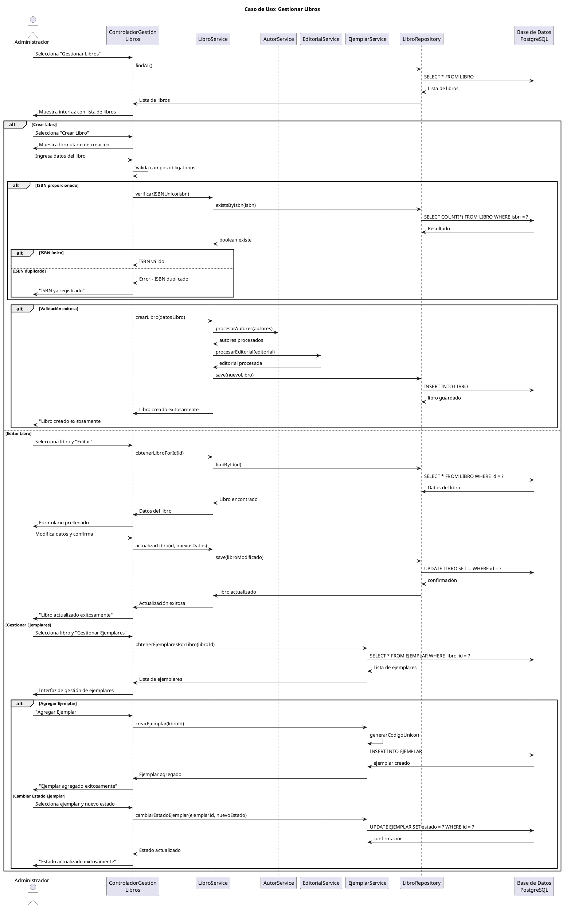

# Caso de Uso: Gestionar Libros
## Referencias
RF3.1, RF3.1.1, RF3.1.2, RF3.1.3, RF3.1.4, RF3.2, RF3.3, RF3.4

## Actores
Administrador

## Tipo
Primario

## Propósito
Permitir al administrador realizar operaciones completas sobre el catálogo de libros: crear, modificar, consultar libros y gestionar sus ejemplares físicos.

## Resumen
El administrador accede al módulo de gestión de libros donde puede ver el catálogo completo, buscar libros específicos, crear nuevos registros de libros con sus autores y editorial, modificar información existente, y gestionar los ejemplares físicos de cada libro incluyendo su disponibilidad y estado.

## CURSO NORMAL DE EVENTOS

| Acción del Actor | Respuesta del Sistema |
|------------------|----------------------|
| 1. El caso de uso comienza cuando el administrador selecciona "Gestionar Libros" desde el dashboard administrativo. | 2. El sistema muestra la interfaz de gestión de libros con lista de libros existentes y opciones de búsqueda. |
| 3. El administrador puede realizar una de las siguientes acciones: Ver lista, Buscar libro, Crear libro, Editar libro, Gestionar ejemplares. | 4a. **Crear Libro**: El sistema muestra formulario con campos: ISBN, título, editorial, autores, fecha publicación, edición, páginas. |
| 5a. El administrador ingresa los datos del nuevo libro y selecciona/crea autores y editorial. | 6a. El sistema valida que el ISBN sea único (si se proporciona) y que los campos obligatorios estén completos. |
| 7a. El administrador confirma la creación del libro. | 8a. El sistema guarda el libro y sus relaciones con autores en la base de datos. |
| | 9a. El sistema muestra confirmación "Libro creado exitosamente" y actualiza la lista. |
| **3b.** El administrador selecciona "Editar" en un libro existente. | **4b.** El sistema muestra el formulario prellenado con los datos actuales del libro. |
| **5b.** El administrador modifica los datos necesarios (título, autores, editorial, etc.). | **6b.** El sistema valida los cambios y verifica integridad referencial. |
| **7b.** El administrador confirma las modificaciones. | **8b.** El sistema actualiza el registro del libro manteniendo la relación con ejemplares existentes. |
| **3c.** El administrador selecciona "Gestionar Ejemplares" en un libro. | **4c.** El sistema muestra la lista de ejemplares del libro con sus estados. |
| **5c.** El administrador puede agregar nuevos ejemplares o cambiar estado de existentes. | **6c.** El sistema asigna códigos únicos a nuevos ejemplares y actualiza estados. |

## CURSOS ALTERNATIVOS

**6a.1** Si el ISBN ya existe en el sistema:
- El sistema muestra "El ISBN ya está registrado para otro libro"
- Vuelve al paso 5a para corrección

**6a.2** Si faltan campos obligatorios (título):
- El sistema resalta campos faltantes en rojo
- Muestra mensajes de error específicos
- Vuelve al paso 5a

**8a.1** Si ocurre error al guardar en base de datos:
- El sistema muestra "Error al crear libro. Intente nuevamente"
- No se crean registros parciales
- Vuelve al paso 5a manteniendo datos ingresados

**6b.1** Si se intenta modificar ISBN por uno ya existente:
- El sistema muestra "El ISBN ya pertenece a otro libro"
- Mantiene el valor original
- Permite continuar con otros cambios

**6c.1** Si se intenta cambiar estado de ejemplar prestado a "no disponible":
- El sistema muestra "No se puede cambiar estado: ejemplar prestado actualmente"
- Mantiene estado actual
- Permite otras operaciones

## Diagrama PlantUML

## Precondiciones
- El administrador debe estar autenticado y autorizado
- El sistema debe tener conexión a la base de datos
- Deben existir al menos los estados básicos de ejemplares en el sistema

## Postcondiciones
- **Éxito Crear**: Nuevo libro registrado con relaciones a autores y editorial
- **Éxito Editar**: Libro actualizado manteniendo integridad referencial  
- **Éxito Ejemplares**: Ejemplares creados/actualizados con códigos únicos
- **Fallo**: No se realizan cambios parciales en la base de datos

## Reglas de Negocio
- **RN1**: El ISBN debe ser único si se proporciona (opcional)
- **RN2**: El título del libro es obligatorio
- **RN3**: Un libro puede tener múltiples autores
- **RN4**: Un libro debe tener una editorial asociada
- **RN5**: Los ejemplares deben tener códigos únicos generados automáticamente
- **RN6**: No se puede eliminar un libro que tiene ejemplares prestados
- **RN7**: Los estados de ejemplares son: DISPONIBLE, PRESTADO, RESERVADO, DAÑADO, PERDIDO
- **RN8**: Solo ejemplares DISPONIBLES pueden ser prestados
- **RN9**: La fecha de publicación no puede ser futura
- **RN10**: Las páginas deben ser un número positivo