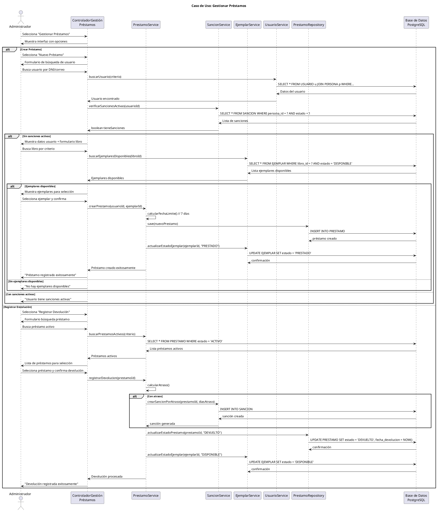

# Caso de Uso: Gestionar Préstamos
## Referencias
RF4.1, RF4.1.1, RF4.1.2, RF4.1.3, RF4.1.4, RF4.2, RF4.3, RF4.4

## Actores
Administrador

## Tipo
Primario

## Propósito
Permitir al administrador gestionar el ciclo completo de préstamos de libros: crear nuevos préstamos, registrar devoluciones, consultar préstamos activos/vencidos, y renovar préstamos existentes.

## Resumen
El administrador accede al módulo de gestión de préstamos donde puede realizar nuevos préstamos verificando disponibilidad y estado del usuario, registrar devoluciones actualizando el estado de ejemplares, consultar préstamos por diferentes criterios, y gestionar renovaciones. El sistema controla automáticamente las fechas límite, genera sanciones por atrasos, y mantiene la trazabilidad de todas las operaciones.

## CURSO NORMAL DE EVENTOS

| Acción del Actor | Respuesta del Sistema |
|------------------|----------------------|
| 1. El caso de uso comienza cuando el administrador selecciona "Gestionar Préstamos" desde el dashboard. | 2. El sistema muestra la interfaz de gestión con pestañas: Nuevo Préstamo, Préstamos Activos, Devoluciones, Renovaciones. |
| 3. **Nuevo Préstamo**: El administrador selecciona "Crear Préstamo" y busca el usuario por DNI o correo. | 4a. El sistema muestra los datos del usuario encontrado y verifica que no tenga sanciones activas. |
| 5a. El administrador busca el libro a prestar por título, ISBN o autor. | 6a. El sistema muestra el libro y verifica disponibilidad de ejemplares (estado DISPONIBLE). |
| 7a. El administrador selecciona el ejemplar específico y confirma el préstamo. | 8a. El sistema establece fecha actual como fecha de préstamo y calcula fecha límite (7 días después). |
| | 9a. El sistema actualiza el estado del ejemplar a "PRESTADO" y crea el registro de préstamo con estado "ACTIVO". |
| | 10a. El sistema muestra confirmación "Préstamo registrado exitosamente" con detalles del préstamo. |
| **3b. Devolución**: El administrador selecciona "Registrar Devolución" y busca el préstamo activo. | **4b.** El sistema muestra lista de préstamos activos del usuario o libro buscado. |
| **5b.** El administrador selecciona el préstamo a devolver y confirma la devolución. | **6b.** El sistema registra fecha actual como fecha de devolución y verifica si hay atraso. |
| | **7b.** El sistema actualiza estado del ejemplar a "DISPONIBLE" y del préstamo a "DEVUELTO". |
| | **8b.** Si hay atraso, el sistema crea automáticamente una sanción correspondiente. |
| | **9b.** El sistema muestra confirmación de devolución y, si aplica, detalles de la sanción generada. |

## CURSOS ALTERNATIVOS

**4a.1** Si el usuario tiene sanciones activas:
- El sistema muestra "Usuario tiene sanciones activas. No puede realizar préstamos"
- Lista las sanciones vigentes con fechas de fin
- No permite continuar con el préstamo

**4a.2** Si el usuario no existe:
- El sistema muestra "Usuario no encontrado"
- Permite nueva búsqueda o crear usuario nuevo

**6a.1** Si no hay ejemplares disponibles:
- El sistema muestra "No hay ejemplares disponibles de este libro"
- Muestra lista de reservas pendientes
- Ofrece opción de crear reserva para el usuario

**6a.2** Si el usuario ya tiene el mismo libro prestado:
- El sistema muestra "El usuario ya tiene este libro prestado"
- Muestra detalles del préstamo existente
- No permite continuar

**8a.1** Si ocurre error al crear el préstamo:
- El sistema muestra "Error al registrar préstamo. Intente nuevamente"
- No actualiza estado del ejemplar
- Mantiene datos ingresados para reintento

**6b.1** Si se intenta devolver un préstamo ya devuelto:
- El sistema muestra "Este préstamo ya fue devuelto anteriormente"
- Muestra detalles de la devolución previa
- No permite continuar

**8b.1** Si hay error al crear sanción por atraso:
- El sistema registra la devolución exitosamente
- Muestra advertencia "Devolución registrada pero error al crear sanción"
- Permite crear sanción manualmente después

## Diagrama PlantUML

## Precondiciones
- El administrador debe estar autenticado y autorizado
- Deben existir usuarios y libros registrados en el sistema
- Los estados de ejemplares y préstamos deben estar configurados
- El sistema debe tener conexión activa a la base de datos

## Postcondiciones
- **Éxito Préstamo**: Ejemplar marcado como PRESTADO, registro de préstamo creado
- **Éxito Devolución**: Ejemplar disponible, préstamo marcado como DEVUELTO
- **Con Atraso**: Sanción automática creada además de registrar devolución
- **Fallo**: No se realizan cambios parciales en estados

## Reglas de Negocio
- **RN1**: La fecha límite por defecto es 7 días desde la fecha de préstamo
- **RN2**: Solo usuarios sin sanciones activas pueden realizar préstamos
- **RN3**: Un usuario no puede tener el mismo libro prestado más de una vez
- **RN4**: Solo ejemplares con estado DISPONIBLE pueden ser prestados
- **RN5**: Las devoluciones con atraso generan sanción automática
- **RN6**: Los días de sanción equivalen a los días de atraso
- **RN7**: Al devolver, el ejemplar vuelve automáticamente a estado DISPONIBLE
- **RN8**: Un préstamo activo solo puede tener una devolución
- **RN9**: Las renovaciones extienden la fecha límite por 7 días adicionales
- **RN10**: Máximo 2 renovaciones por préstamo
- **RN11**: No se puede renovar un préstamo vencido
- **RN12**: No se puede renovar si hay reservas del mismo libro