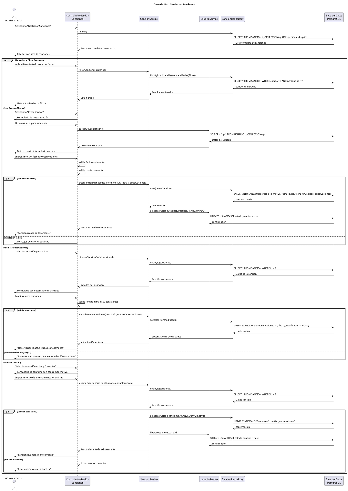

# Caso de Uso: Gestionar Sanciones
## Referencias
RF6.1, RF6.1.1, RF6.1.2, RF6.1.3, RF6.2, RF6.3, RF6.4

## Actores
Administrador

## Tipo
Primario

## Propósito
Permitir al administrador gestionar el sistema completo de sanciones: consultar sanciones automáticas generadas por atrasos, crear sanciones manuales por otros motivos, modificar observaciones, levantar sanciones anticipadamente, y controlar el bloqueo de usuarios sancionados.

## Resumen
El administrador accede al módulo de gestión de sanciones donde puede visualizar todas las sanciones del sistema (activas, cumplidas, canceladas), crear nuevas sanciones manuales por motivos específicos, actualizar observaciones para documentar el seguimiento, levantar sanciones antes del tiempo establecido, y verificar el impacto de las sanciones en el acceso a servicios de biblioteca.

## CURSO NORMAL DE EVENTOS

| Acción del Actor | Respuesta del Sistema |
|------------------|----------------------|
| 1. El caso de uso comienza cuando el administrador selecciona "Gestionar Sanciones" desde el dashboard. | 2. El sistema muestra la interfaz de sanciones con pestañas: Lista Sanciones, Crear Sanción, Sanciones por Usuario. |
| 3. **Consultar Sanciones**: El administrador visualiza la lista completa de sanciones con filtros por estado, usuario o fecha. | 4a. El sistema muestra tabla con: usuario, motivo, fechas inicio/fin, estado, días restantes, observaciones. |
| 5a. El administrador puede filtrar por estado (Activa/Cumplida/Cancelada) o buscar por usuario específico. | 6a. El sistema actualiza la lista aplicando los filtros seleccionados y resalta sanciones próximas a vencer. |
| **3b. Crear Sanción Manual**: El administrador selecciona "Crear Sanción" para aplicar sanción por motivos administrativos. | **4b.** El sistema muestra formulario con campos: usuario, motivo, fecha inicio, fecha fin, observaciones. |
| **5b.** El administrador busca el usuario, ingresa motivo de sanción, establece período y agrega observaciones. | **6b.** El sistema valida que las fechas sean coherentes y que el motivo esté especificado. |
| **7b.** El administrador confirma la creación de la sanción. | **8b.** El sistema crea la sanción con estado ACTIVA y actualiza el perfil del usuario. |
| | **9b.** El sistema muestra confirmación "Sanción creada exitosamente" y envía al listado actualizado. |
| **3c. Modificar Sanción**: El administrador selecciona una sanción existente para actualizar observaciones. | **4c.** El sistema muestra el detalle de la sanción con campo editable de observaciones. |
| **5c.** El administrador agrega comentarios, seguimiento o justificaciones en las observaciones. | **6c.** El sistema valida el formato y longitud de las observaciones (máximo 500 caracteres). |
| **7c.** El administrador guarda las modificaciones. | **8c.** El sistema actualiza las observaciones y registra timestamp del cambio. |
| **3d. Levantar Sanción**: El administrador selecciona una sanción activa para cancelarla anticipadamente. | **4d.** El sistema muestra confirmación solicitando motivo del levantamiento. |
| **5d.** El administrador ingresa justificación y confirma el levantamiento. | **6d.** El sistema cambia estado a CANCELADA, registra motivo y libera restricciones del usuario. |

## CURSOS ALTERNATIVOS

**6a.1** Si no existen sanciones en el sistema:
- El sistema muestra "No hay sanciones registradas"
- Ofrece opción de crear nueva sanción manual

**6a.2** Si el filtro no arroja resultados:
- El sistema muestra "No se encontraron sanciones con los criterios especificados"
- Permite limpiar filtros y mostrar todas

**6b.1** Si el usuario seleccionado ya tiene sanción activa:
- El sistema muestra advertencia "El usuario ya tiene una sanción activa"
- Permite continuar para crear sanción adicional o cancelar

**6b.2** Si la fecha fin es anterior a fecha inicio:
- El sistema muestra "La fecha de fin debe ser posterior a la fecha de inicio"
- Resalta campos de fecha en rojo
- Vuelve al paso 5b

**8b.1** Si ocurre error al crear la sanción:
- El sistema muestra "Error al crear sanción. Verifique los datos"
- Mantiene datos ingresados para corrección
- No actualiza estado del usuario

**6c.1** Si las observaciones exceden 500 caracteres:
- El sistema muestra contador de caracteres en rojo
- Mensaje "Las observaciones no pueden exceder 500 caracteres"
- Bloquea guardar hasta corregir

**6d.1** Si se intenta levantar sanción ya cumplida o cancelada:
- El sistema muestra "Esta sanción ya no está activa"
- No permite modificar estado
- Redirige a la lista de sanciones

## Diagrama PlantUML

## Precondiciones
- El administrador debe estar autenticado y autorizado para gestionar sanciones
- Deben existir usuarios registrados en el sistema
- Los estados de sanción deben estar configurados (1=ACTIVA, 2=CUMPLIDA, 3=CANCELADA)
- El sistema debe tener conexión activa a la base de datos

## Postcondiciones
- **Éxito Consulta**: Lista de sanciones actualizada según filtros aplicados
- **Éxito Crear**: Nueva sanción registrada y usuario marcado como sancionado
- **Éxito Modificar**: Observaciones actualizadas con timestamp de cambio
- **Éxito Levantar**: Sanción cancelada y usuario liberado de restricciones
- **Fallo**: No se realizan cambios parciales en el estado de sanciones

## Reglas de Negocio
- **RN1**: Las sanciones automáticas se generan por días de atraso (1 día atraso = 1 día sanción)
- **RN2**: Los usuarios sancionados no pueden realizar préstamos ni reservas
- **RN3**: Una sanción manual debe tener motivo específico y fechas válidas
- **RN4**: La fecha de fin debe ser posterior a la fecha de inicio
- **RN5**: Las observaciones tienen límite de 500 caracteres
- **RN6**: Solo se pueden levantar sanciones con estado ACTIVA
- **RN7**: Al levantar una sanción se debe registrar el motivo de cancelación
- **RN8**: Las sanciones cumplidas (fecha_fin < hoy) cambian automáticamente a estado CUMPLIDA
- **RN9**: Un usuario puede tener múltiples sanciones históricas pero solo una activa
- **RN10**: Las modificaciones de observaciones registran timestamp para auditoría
- **RN11**: Las sanciones automáticas tienen motivo "Devolución tardía - X días de atraso"
- **RN12**: Los administradores pueden ver todas las sanciones del sistema