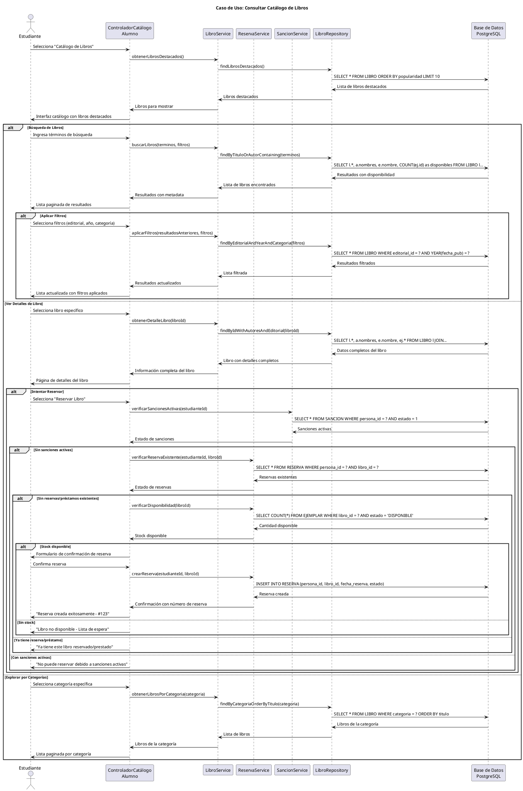

# Caso de Uso: Consultar Catálogo de Libros
## Referencias
RF7.1, RF7.1.1, RF7.1.2, RF7.1.3, RF7.2, RF7.3

## Actores
Estudiante

## Tipo
Primario

## Propósito
Permitir a los estudiantes explorar y buscar libros en el catálogo de la biblioteca, visualizar información detallada de cada libro, verificar disponibilidad en tiempo real, y acceder a opciones de reserva cuando corresponda.

## Resumen
El estudiante accede al catálogo público de libros desde su portal donde puede realizar búsquedas por diferentes criterios (título, autor, ISBN), aplicar filtros por editorial o categoría, visualizar resultados paginados con información relevante, y acceder a detalles completos de cada libro incluyendo disponibilidad de ejemplares y opciones de reserva.

## CURSO NORMAL DE EVENTOS

| Acción del Actor | Respuesta del Sistema |
|------------------|----------------------|
| 1. El caso de uso comienza cuando el estudiante selecciona "Catálogo de Libros" desde su dashboard. | 2. El sistema muestra la interfaz del catálogo con campo de búsqueda, filtros, y lista de libros destacados/recientes. |
| 3. **Búsqueda Simple**: El estudiante ingresa términos de búsqueda en el campo principal (título, autor, o palabras clave). | 4a. El sistema realiza búsqueda en tiempo real mientras el estudiante escribe, mostrando sugerencias automáticas. |
| 5a. El estudiante presiona "Buscar" o selecciona una sugerencia. | 6a. El sistema ejecuta la búsqueda y muestra resultados paginados con: título, autor(es), editorial, disponibilidad. |
| 7a. El estudiante puede aplicar filtros adicionales (editorial, año, categoría) para refinar resultados. | 8a. El sistema actualiza los resultados aplicando los filtros seleccionados y mantiene la búsqueda original. |
| **3b. Exploración por Categorías**: El estudiante navega por categorías predefinidas sin búsqueda específica. | **4b.** El sistema muestra libros organizados por categorías populares: Literatura, Ingeniería, Ciencias, etc. |
| **5b.** El estudiante selecciona una categoría de interés. | **6b.** El sistema filtra y muestra todos los libros de la categoría seleccionada con paginación. |
| **3c. Ver Detalles**: El estudiante hace clic en un libro específico para ver información completa. | **4c.** El sistema muestra página de detalles con: información completa, autores, editorial, ejemplares disponibles, estado. |
| **5c.** Si hay ejemplares disponibles, el estudiante puede seleccionar "Reservar Libro". | **6c.** El sistema verifica que el estudiante no tenga sanciones activas y no tenga el libro ya prestado/reservado. |
| **7c.** El estudiante confirma la reserva del libro. | **8c.** El sistema crea la reserva con estado PENDIENTE y muestra confirmación con número de reserva. |

## CURSOS ALTERNATIVOS

**6a.1** Si la búsqueda no arroja resultados:
- El sistema muestra "No se encontraron libros con los criterios especificados"
- Sugiere búsquedas similares o más generales
- Ofrece explorar por categorías

**6a.2** Si la búsqueda arroja demasiados resultados (>100):
- El sistema muestra mensaje "Búsqueda muy amplia. Se muestran los primeros 100 resultados"
- Sugiere usar filtros para refinar la búsqueda
- Ordena por relevancia

**8a.1** Si los filtros eliminan todos los resultados:
- El sistema muestra "No hay libros que cumplan todos los filtros"
- Permite quitar filtros uno por uno
- Sugiere filtros alternativos

**6c.1** Si el estudiante tiene sanciones activas:
- El sistema muestra "No puede realizar reservas debido a sanciones activas"
- Lista las sanciones con fechas de fin
- Redirige a "Mis Sanciones" para más detalles

**6c.2** Si el estudiante ya tiene el libro prestado:
- El sistema muestra "Ya tiene este libro prestado actualmente"
- Muestra detalles del préstamo existente con fecha límite
- No permite reservar

**6c.3** Si el estudiante ya tiene el libro reservado:
- El sistema muestra "Ya tiene una reserva pendiente de este libro"
- Muestra detalles de la reserva existente
- Ofrece opción de cancelar reserva actual

**8c.1** Si no hay stock suficiente (todas las copias prestadas/reservadas):
- El sistema muestra "Libro no disponible actualmente"
- Muestra lista de espera con posición estimada
- Permite unirse a lista de espera

## Diagrama PlantUML

## Precondiciones
- El estudiante debe estar autenticado en el sistema
- Debe existir un catálogo de libros en la base de datos
- Los estados de ejemplares deben estar actualizados
- El sistema debe tener conexión activa a la base de datos

## Postcondiciones
- **Éxito Búsqueda**: Lista de libros mostrada según criterios con información actualizada
- **Éxito Detalles**: Información completa del libro desplegada con disponibilidad actual
- **Éxito Reserva**: Nueva reserva creada con estado PENDIENTE
- **Fallo Reserva**: Mensaje específico mostrado sin crear reserva

## Reglas de Negocio
- **RN1**: Los estudiantes solo pueden ver libros del catálogo público
- **RN2**: La disponibilidad se calcula en tiempo real basada en ejemplares no prestados/reservados
- **RN3**: Los estudiantes sancionados no pueden realizar reservas
- **RN4**: Un estudiante no puede tener el mismo libro prestado y reservado simultáneamente
- **RN5**: Las búsquedas son case-insensitive y permiten coincidencias parciales
- **RN6**: Los resultados se paginan cada 20 libros para optimizar carga
- **RN7**: Los filtros se pueden combinar para refinar búsquedas
- **RN8**: Las sugerencias automáticas aparecen después de 3 caracteres
- **RN9**: Los libros sin ejemplares disponibles se muestran como "No disponible"
- **RN10**: Las reservas se crean con estado PENDIENTE para aprobación del administrador