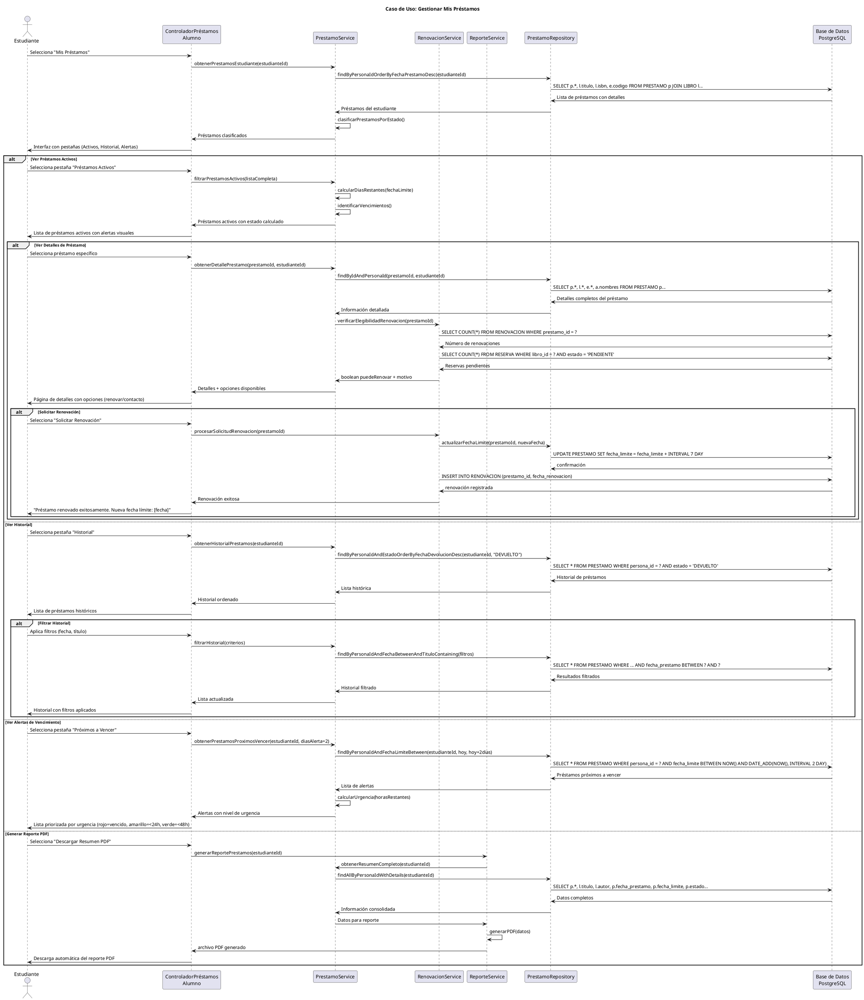

# Caso de Uso: Gestionar Mis Préstamos
## Referencias
RF4.3, RF4.3.2, RF4.3.3, RF8.1, RF8.1.1, RF8.1.4

## Actores
Estudiante

## Tipo
Primario

## Propósito
Permitir a los estudiantes consultar y gestionar sus préstamos personales, visualizar el estado actual de libros prestados, verificar fechas límite, consultar historial de préstamos anteriores, y recibir alertas sobre devoluciones próximas.

## Resumen
El estudiante accede a su sección personal "Mis Préstamos" donde puede visualizar todos sus préstamos actuales con información detallada (libro, fecha de préstamo, fecha límite, días restantes), consultar su historial completo de préstamos anteriores, identificar préstamos vencidos que requieren atención inmediata, y recibir recordatorios automáticos sobre fechas límite próximas.

## CURSO NORMAL DE EVENTOS

| Acción del Actor | Respuesta del Sistema |
|------------------|----------------------|
| 1. El caso de uso comienza cuando el estudiante selecciona "Mis Préstamos" desde su dashboard personal. | 2. El sistema muestra la interfaz de préstamos con pestañas: Préstamos Activos, Historial, Próximos a Vencer. |
| 3. **Préstamos Activos**: El estudiante visualiza la pestaña por defecto que muestra préstamos actuales. | 4a. El sistema lista préstamos con estado ACTIVO mostrando: libro, fecha préstamo, fecha límite, días restantes, estado. |
| 5a. El estudiante puede ver detalles específicos haciendo clic en un préstamo. | 6a. El sistema muestra información detallada: datos completos del libro, fechas, ejemplar específico prestado, renovaciones disponibles. |
| **3b. Historial de Préstamos**: El estudiante selecciona la pestaña "Historial" para ver préstamos anteriores. | **4b.** El sistema muestra préstamos con estado DEVUELTO ordenados por fecha de devolución descendente. |
| **5b.** El estudiante puede filtrar el historial por período específico o buscar por título de libro. | **6b.** El sistema aplica filtros y actualiza la lista mostrando solo préstamos que cumplen criterios seleccionados. |
| **3c. Alertas de Vencimiento**: El estudiante revisa la sección de préstamos próximos a vencer. | **4c.** El sistema destaca préstamos que vencen en los próximos 2 días con alerta visual (color rojo/amarillo). |
| **5c.** El estudiante identifica préstamos urgentes que requieren devolución o renovación. | **6c.** El sistema muestra opciones disponibles: "Solicitar Renovación" (si aplica) o información de contacto para devolución. |
| 7. El estudiante puede descargar un resumen de sus préstamos en formato PDF para sus registros personales. | 8. El sistema genera reporte PDF con préstamos activos, historial reciente y próximos vencimientos. |

## CURSOS ALTERNATIVOS

**4a.1** Si el estudiante no tiene préstamos activos:
- El sistema muestra "No tiene préstamos activos actualmente"
- Ofrece enlace directo al catálogo para realizar nuevas reservas
- Muestra sugerencias de libros populares

**4a.2** Si existe un préstamo vencido:
- El sistema resalta el préstamo vencido en color rojo
- Muestra alerta "PRÉSTAMO VENCIDO - Devolver inmediatamente"
- Indica días de atraso y posible sanción

**6a.1** Si el préstamo está próximo a vencer (≤2 días):
- El sistema muestra recordatorio prominente
- Calcula y muestra horas exactas hasta vencimiento
- Ofrece información de contacto de biblioteca

**6a.2** Si el préstamo es elegible para renovación:
- El sistema muestra botón "Solicitar Renovación"
- Indica cuántas renovaciones quedan disponibles (máx 2)
- Muestra nueva fecha límite proyectada

**6a.3** Si el préstamo NO es elegible para renovación:
- El sistema explica por qué no se puede renovar:
  - "Préstamo ya renovado 2 veces (máximo permitido)"
  - "Libro tiene reservas pendientes de otros usuarios"
  - "Préstamo vencido - debe devolver antes de renovar"

**4b.1** Si no hay historial de préstamos:
- El sistema muestra "No tiene historial de préstamos"
- Muestra fecha de registro en biblioteca
- Invita a explorar el catálogo

**6b.1** Si el filtro de período no arroja resultados:
- El sistema muestra "No hay préstamos en el período seleccionado"
- Sugiere ampliar el rango de fechas
- Permite limpiar filtros

**4c.1** Si no hay préstamos próximos a vencer:
- El sistema muestra "Todas las devoluciones están al día"
- Muestra fecha del próximo vencimiento más cercano
- Ofrece suscribirse a recordatorios por email

## Diagrama PlantUML

## Precondiciones
- El estudiante debe estar autenticado en el sistema
- El estudiante debe tener una cuenta activa de biblioteca
- Deben existir registros de préstamos asociados al estudiante
- El sistema debe tener conexión activa a la base de datos

## Postcondiciones
- **Éxito Consulta**: Información actual de préstamos mostrada correctamente
- **Éxito Renovación**: Fecha límite extendida y renovación registrada
- **Éxito Reporte**: Archivo PDF generado y descargado
- **Consulta**: No se realizan modificaciones en los datos del sistema

## Reglas de Negocio
- **RN1**: Los estudiantes solo pueden ver sus propios préstamos
- **RN2**: Los préstamos se clasifican automáticamente por estado (ACTIVO, DEVUELTO, VENCIDO)
- **RN3**: Las alertas de vencimiento se muestran 2 días antes de la fecha límite
- **RN4**: Un préstamo puede renovarse máximo 2 veces
- **RN5**: No se puede renovar un préstamo vencido
- **RN6**: No se puede renovar si hay reservas pendientes del mismo libro
- **RN7**: Cada renovación extiende la fecha límite por 7 días adicionales
- **RN8**: Los préstamos vencidos se resaltan en color rojo con días de atraso
- **RN9**: El historial se ordena por fecha de devolución descendente
- **RN10**: Los reportes PDF incluyen solo préstamos de los últimos 12 meses
- **RN11**: Los filtros de historial permiten búsqueda por período y título
- **RN12**: Los recordatorios automáticos se envían 24 horas antes del vencimiento