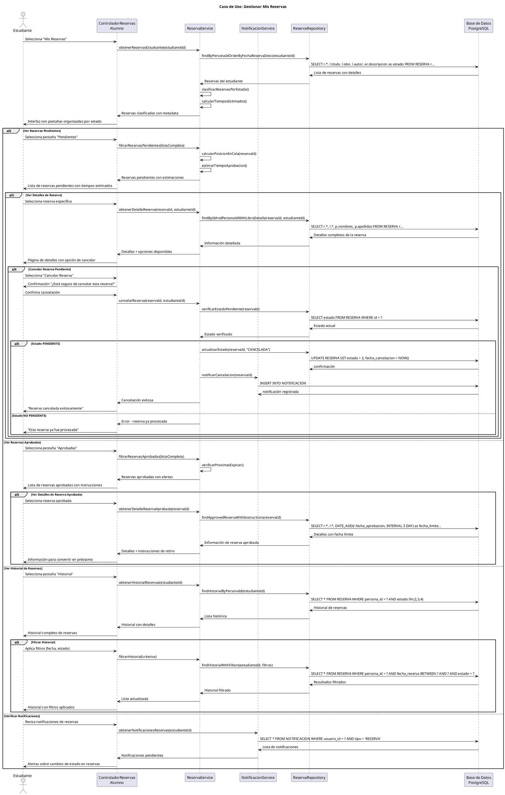

# Caso de Uso: Gestionar Mis Reservas
## Referencias
RF5.3, RF5.3.2, RF5.3.3, RF5.4, RF5.4.1, RF8.1.2

## Actores
Estudiante

## Tipo
Primario

## Propósito
Permitir a los estudiantes gestionar sus reservas de libros de manera autónoma: consultar reservas actuales, verificar el estado de aprobación, cancelar reservas pendientes, y recibir notificaciones sobre cambios en el estado de sus solicitudes.

## Resumen
El estudiante accede a su sección "Mis Reservas" donde puede visualizar todas sus reservas organizadas por estado (pendientes, aprobadas, rechazadas, canceladas), consultar detalles específicos de cada reserva incluyendo fecha de solicitud y motivos de rechazo si aplican, cancelar reservas pendientes que ya no necesita, y recibir información sobre el proceso de conversión de reservas aprobadas a préstamos.

## CURSO NORMAL DE EVENTOS

| Acción del Actor | Respuesta del Sistema |
|------------------|----------------------|
| 1. El caso de uso comienza cuando el estudiante selecciona "Mis Reservas" desde su dashboard personal. | 2. El sistema muestra la interfaz de reservas con pestañas: Pendientes, Aprobadas, Historial (rechazadas/canceladas). |
| 3. **Reservas Pendientes**: El estudiante visualiza reservas esperando aprobación del administrador. | 4a. El sistema lista reservas con estado PENDIENTE mostrando: libro solicitado, fecha de reserva, posición en cola, tiempo estimado. |
| 5a. El estudiante puede ver detalles de una reserva específica haciendo clic en ella. | 6a. El sistema muestra información detallada: datos del libro, fecha de solicitud, justificación, estado actual del proceso. |
| 7a. El estudiante puede cancelar una reserva pendiente que ya no necesita. | 8a. El sistema solicita confirmación de cancelación y actualiza el estado a CANCELADA. |
| **3b. Reservas Aprobadas**: El estudiante revisa reservas que fueron aprobadas por el administrador. | **4b.** El sistema lista reservas APROBADAS mostrando: libro reservado, fecha de aprobación, instrucciones para retirar. |
| **5b.** El estudiante ve los detalles de una reserva aprobada. | **6b.** El sistema muestra información de contacto de biblioteca y procedimiento para convertir la reserva en préstamo. |
| **3c. Historial de Reservas**: El estudiante consulta reservas anteriores (rechazadas, canceladas, convertidas). | **4c.** El sistema muestra historial completo con motivos de rechazo/cancelación y fechas de todas las acciones. |
| **5c.** El estudiante puede filtrar el historial por período o estado específico. | **6c.** El sistema aplica filtros y actualiza la vista mostrando solo reservas que cumplen los criterios. |
| 9. El estudiante recibe notificaciones automáticas sobre cambios de estado en sus reservas. | 10. El sistema muestra alertas en dashboard y envía notificaciones cuando reservas cambian de estado. |

## CURSOS ALTERNATIVOS

**4a.1** Si el estudiante no tiene reservas pendientes:
- El sistema muestra "No tiene reservas pendientes actualmente"
- Ofrece enlace directo al catálogo para realizar nuevas reservas
- Muestra información sobre el proceso de reservas

**4a.2** Si existe una reserva con prioridad alta (libro próximo a estar disponible):
- El sistema destaca la reserva con indicador visual especial
- Muestra mensaje "Libro próximo a estar disponible"
- Proporciona tiempo estimado más preciso

**8a.1** Si el estudiante intenta cancelar una reserva ya procesada:
- El sistema muestra "Esta reserva ya fue procesada y no puede cancelarse"
- Explica el estado actual de la reserva
- Redirige a la pestaña correspondiente

**8a.2** Si ocurre error al cancelar la reserva:
- El sistema muestra "Error al cancelar reserva. Intente nuevamente"
- Mantiene el estado original de la reserva
- Ofrece contactar al administrador

**4b.1** Si una reserva aprobada está próxima a expirar:
- El sistema resalta la reserva en color amarillo/rojo
- Muestra "Reserva expira en X días"
- Proporciona información urgente de contacto

**4b.2** Si no hay reservas aprobadas:
- El sistema muestra "No tiene reservas aprobadas"
- Explica el proceso de aprobación
- Sugiere revisar reservas pendientes

**4c.1** Si no existe historial de reservas:
- El sistema muestra "No tiene historial de reservas"
- Muestra fecha de registro en el sistema
- Invita a explorar el catálogo

**6c.1** Si los filtros no arrojan resultados:
- El sistema muestra "No hay reservas en el período/estado seleccionado"
- Permite ajustar criterios de filtrado
- Ofrece limpiar todos los filtros

## Diagrama PlantUML

## Precondiciones
- El estudiante debe estar autenticado en el sistema
- El estudiante debe tener una cuenta activa de biblioteca
- El sistema debe estar configurado con estados de reservas válidos
- El sistema debe tener conexión activa a la base de datos

## Postcondiciones
- **Éxito Consulta**: Información actual de reservas mostrada por estado
- **Éxito Cancelación**: Reserva actualizada a estado CANCELADA con timestamp
- **Éxito Filtros**: Vista actualizada según criterios de filtrado
- **Consulta**: No se modifican datos excepto en cancelaciones

## Reglas de Negocio
- **RN1**: Los estudiantes solo pueden ver y gestionar sus propias reservas
- **RN2**: Solo se pueden cancelar reservas con estado PENDIENTE
- **RN3**: Las reservas se organizan por estado: PENDIENTE(1), APROBADA(2), RECHAZADA(3), CANCELADA(4)
- **RN4**: Las reservas aprobadas tienen 3 días para convertirse en préstamo antes de expirar
- **RN5**: La posición en cola se calcula por fecha de reserva (primero en llegar, primero en ser atendido)
- **RN6**: Los estudiantes reciben notificaciones automáticas cuando cambia el estado de sus reservas
- **RN7**: El tiempo estimado de aprobación se basa en disponibilidad actual y reservas anteriores
- **RN8**: Las reservas canceladas no pueden reactivarse, debe crear nueva reserva
- **RN9**: El historial incluye motivos de rechazo cuando son proporcionados por administradores
- **RN10**: Las reservas de libros con alta demanda tienen prioridad especial en la visualización
- **RN11**: Los filtros de historial permiten consulta por período de hasta 12 meses
- **RN12**: Una reserva aprobada no puede cancelarse, debe contactar administrador