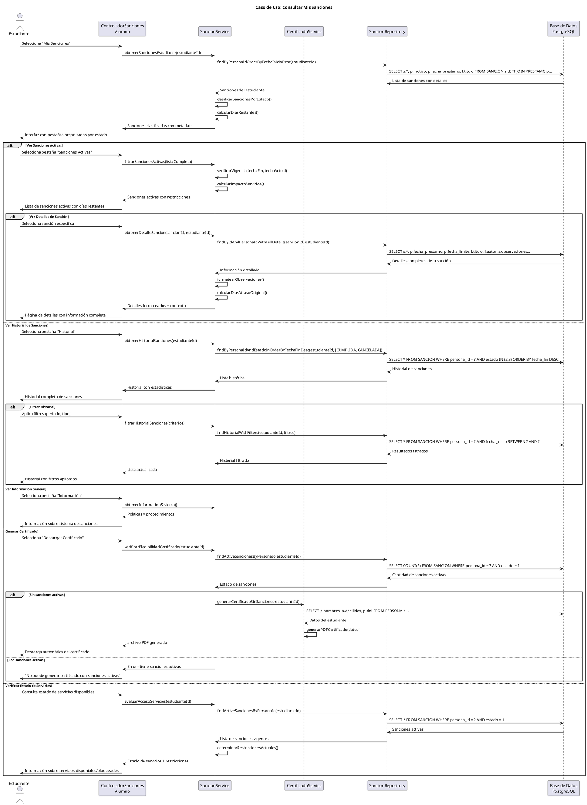

# Caso de Uso: Consultar Mis Sanciones
## Referencias
RF6.3, RF6.3.2, RF6.3.3, RF8.1.3

## Actores
Estudiante

## Tipo
Secundario

## Propósito
Permitir a los estudiantes consultar sus sanciones personales, entender los motivos de cada sanción, verificar períodos de vigencia, revisar el historial de sanciones cumplidas, y comprender el impacto de las sanciones activas en su acceso a servicios de biblioteca.

## Resumen
El estudiante accede a su sección "Mis Sanciones" donde puede visualizar sanciones activas que están afectando su acceso a servicios, consultar detalles específicos incluyendo motivos y fechas de cada sanción, revisar historial de sanciones anteriores ya cumplidas, y obtener información sobre cuándo podrá volver a utilizar los servicios de préstamo y reserva de la biblioteca.

## CURSO NORMAL DE EVENTOS

| Acción del Actor | Respuesta del Sistema |
|------------------|----------------------|
| 1. El caso de uso comienza cuando el estudiante selecciona "Mis Sanciones" desde su dashboard personal. | 2. El sistema muestra la interfaz de sanciones con pestañas: Sanciones Activas, Historial de Sanciones, Información General. |
| 3. **Sanciones Activas**: El estudiante visualiza sanciones que están actualmente vigentes y afectando sus servicios. | 4a. El sistema lista sanciones con estado ACTIVA mostrando: motivo, fecha inicio, fecha fin, días restantes, restricciones aplicadas. |
| 5a. El estudiante puede ver detalles completos de una sanción específica haciendo clic en ella. | 6a. El sistema muestra información detallada: motivo completo, préstamo que originó la sanción, observaciones del administrador, impacto en servicios. |
| **3b. Historial de Sanciones**: El estudiante consulta sanciones anteriores que ya fueron cumplidas o canceladas. | **4b.** El sistema lista sanciones con estado CUMPLIDA o CANCELADA ordenadas por fecha de fin descendente. |
| **5b.** El estudiante puede filtrar el historial por período específico o tipo de sanción. | **6b.** El sistema aplica filtros y muestra solo sanciones que cumplen con los criterios seleccionados. |
| **3c. Información General**: El estudiante consulta información sobre el sistema de sanciones y sus políticas. | **4c.** El sistema muestra explicación del sistema de sanciones, tipos de infracciones, procedimientos de apelación, y contactos. |
| 7. El estudiante puede descargar un certificado de sanciones para trámites administrativos si no tiene sanciones activas. | 8. El sistema genera certificado PDF confirmando que el estudiante no tiene sanciones vigentes o lista las sanciones activas. |

## CURSOS ALTERNATIVOS

**4a.1** Si el estudiante no tiene sanciones activas:
- El sistema muestra "No tiene sanciones activas actualmente"
- Muestra fecha de última sanción cumplida (si existe)
- Confirma que puede utilizar todos los servicios de biblioteca

**4a.2** Si existe una sanción próxima a cumplirse (≤2 días):
- El sistema destaca la sanción con indicador visual positivo (verde)
- Muestra "Sanción finaliza en X días"
- Proporciona fecha exacta de liberación

**6a.1** Si la sanción tiene observaciones adicionales del administrador:
- El sistema muestra sección expandible "Observaciones del Administrador"
- Incluye cualquier comentario o seguimiento registrado
- Muestra fechas de modificación de observaciones

**6a.2** Si la sanción está relacionada con un préstamo específico:
- El sistema muestra enlace al détalle del préstamo relacionado
- Incluye información del libro y fechas del préstamo
- Calcula y muestra días de atraso que causaron la sanción

**4b.1** Si el estudiante no tiene historial de sanciones:
- El sistema muestra "No tiene historial de sanciones"
- Confirma buen comportamiento en biblioteca
- Motiva a mantener el cumplimiento de políticas

**6b.1** Si el filtro no arroja resultados:
- El sistema muestra "No hay sanciones en el período seleccionado"
- Sugiere ampliar criterios de búsqueda
- Permite limpiar filtros aplicados

**8.1** Si se intenta generar certificado con sanciones activas:
- El sistema muestra "No se puede generar certificado con sanciones activas"
- Lista las sanciones vigentes que impiden la emisión
- Indica fechas cuando podrá obtener el certificado

**8.2** Si ocurre error al generar el certificado:
- El sistema muestra "Error temporal al generar certificado"
- Ofrece intentar nuevamente o contactar administración
- Mantiene disponible la opción para reintento

## Diagrama PlantUML

## Precondiciones
- El estudiante debe estar autenticado en el sistema
- El estudiante debe tener una cuenta activa en la biblioteca
- El sistema debe tener configurados los estados de sanciones correctamente
- El sistema debe tener conexión activa a la base de datos

## Postcondiciones
- **Éxito Consulta**: Información actual de sanciones mostrada correctamente
- **Éxito Certificado**: Documento PDF generado y descargado (solo sin sanciones activas)
- **Éxito Filtros**: Vista actualizada según criterios de filtrado aplicados
- **Consulta**: No se realizan modificaciones en los datos del sistema

## Reglas de Negocio
- **RN1**: Los estudiantes solo pueden consultar sus propias sanciones
- **RN2**: Las sanciones se clasifican por estado: ACTIVA(1), CUMPLIDA(2), CANCELADA(3)
- **RN3**: Una sanción está activa si la fecha actual está entre fecha_inicio y fecha_fin
- **RN4**: Los estudiantes con sanciones activas no pueden realizar préstamos ni reservas
- **RN5**: El certificado solo se genera para estudiantes sin sanciones activas
- **RN6**: Las sanciones automáticas tienen motivo estándar basado en días de atraso
- **RN7**: Las observaciones del administrador se muestran formateadas y organizadas
- **RN8**: El historial incluye motivos de cancelación cuando la sanción fue levantada
- **RN9**: Los filtros de historial permiten consulta por período máximo de 24 meses
- **RN10**: Las sanciones próximas a cumplirse (≤2 días) se destacan visualmente
- **RN11**: El sistema calcula automáticamente días restantes de sanción
- **RN12**: Los estudiantes pueden ver el préstamo específico que originó cada sanción automática