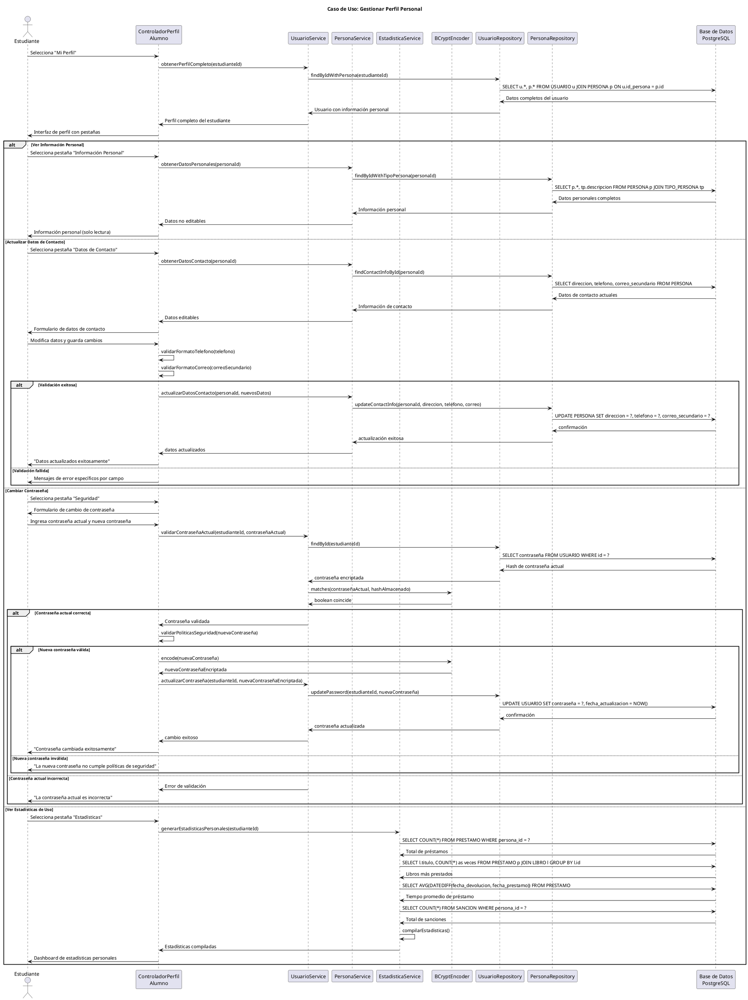

# Caso de Uso: Gestionar Perfil Personal
## Referencias
RF8.2, RF8.2.1, RF8.2.2, RF8.2.3, RF8.2.4

## Actores
Estudiante

## Tipo
Secundario

## Propósito
Permitir a los estudiantes consultar y actualizar su información personal registrada en el sistema de biblioteca, incluyendo datos de contacto, verificar información académica, y mantener actualizada su información para comunicaciones efectivas con la biblioteca.

## Resumen
El estudiante accede a su perfil personal donde puede visualizar toda su información registrada (datos personales, académicos, de contacto), actualizar campos editables como dirección, teléfono y correo de contacto secundario, cambiar su contraseña de acceso, y verificar que su información esté correcta y actualizada para recibir notificaciones y comunicaciones de la biblioteca.

## CURSO NORMAL DE EVENTOS

| Acción del Actor | Respuesta del Sistema |
|------------------|----------------------|
| 1. El caso de uso comienza cuando el estudiante selecciona "Mi Perfil" desde su dashboard personal. | 2. El sistema muestra la interfaz del perfil con pestañas: Información Personal, Datos de Contacto, Seguridad, Estadísticas de Uso. |
| 3. **Información Personal**: El estudiante visualiza sus datos básicos registrados en el sistema. | 4a. El sistema muestra datos no editables: nombres, apellidos, DNI, tipo de usuario, fecha de registro, estado de cuenta. |
| 5a. El estudiante verifica que la información personal sea correcta y esté actualizada. | 6a. El sistema proporciona información de contacto del administrador para solicitar cambios en datos no editables. |
| **3b. Datos de Contacto**: El estudiante accede a la sección de información de contacto editable. | **4b.** El sistema muestra formulario con campos editables: dirección, teléfono, correo secundario, preferencias de notificación. |
| **5b.** El estudiante modifica los datos de contacto que necesita actualizar. | **6b.** El sistema valida formato de campos (teléfono, correo) y longitud de texto en tiempo real. |
| **7b.** El estudiante guarda los cambios realizados en sus datos de contacto. | **8b.** El sistema actualiza la información y muestra confirmación "Datos actualizados exitosamente". |
| **3c. Seguridad**: El estudiante accede a opciones de seguridad de su cuenta. | **4c.** El sistema muestra formulario para cambio de contraseña y configuración de seguridad. |
| **5c.** El estudiante ingresa contraseña actual y nueva contraseña dos veces para confirmar. | **6c.** El sistema valida que la contraseña actual sea correcta y que la nueva cumpla políticas de seguridad. |
| **7c.** El estudiante confirma el cambio de contraseña. | **8c.** El sistema encripta la nueva contraseña con BCrypt y actualiza el registro. |
| **3d. Estadísticas de Uso**: El estudiante consulta su actividad en la biblioteca. | **4d.** El sistema muestra estadísticas: total de préstamos, libros más prestados, tiempo promedio de préstamo, historial de sanciones. |

## CURSOS ALTERNATIVOS

**6a.1** Si el estudiante detecta información personal incorrecta:
- El sistema muestra instructivo para solicitar corrección
- Proporciona formulario de contacto con administrador
- Explica documentos necesarios para validar cambios

**6b.1** Si el formato del teléfono es inválido:
- El sistema muestra "Ingrese un número de teléfono válido (9 dígitos)"
- Resalta el campo en rojo
- Proporciona ejemplo de formato correcto

**6b.2** Si el correo secundario tiene formato inválido:
- El sistema muestra "Ingrese un correo electrónico válido"
- Valida formato en tiempo real mientras escribe
- No permite guardar hasta corregir

**8b.1** Si ocurre error al guardar cambios de contacto:
- El sistema muestra "Error al actualizar datos. Intente nuevamente"
- Mantiene los datos ingresados para no perder cambios
- Ofrece reintento automático

**6c.1** Si la contraseña actual es incorrecta:
- El sistema muestra "La contraseña actual es incorrecta"
- Limpia el campo de contraseña actual
- Incrementa contador de intentos fallidos

**6c.2** Si la nueva contraseña no cumple políticas de seguridad:
- El sistema muestra políticas específicas no cumplidas:
  - "Mínimo 8 caracteres"
  - "Debe incluir al menos un número"
  - "Debe incluir al menos una mayúscula"
- Proporciona indicador visual de fortaleza

**6c.3** Si las dos nuevas contraseñas no coinciden:
- El sistema muestra "Las contraseñas no coinciden"
- Resalta ambos campos de nueva contraseña
- Limpia campos para reingreso

**8c.1** Si ocurre error al cambiar contraseña:
- El sistema muestra "Error al cambiar contraseña. Intente nuevamente"
- No modifica la contraseña actual
- Registra el intento para auditoría

## Diagrama PlantUML

## Precondiciones
- El estudiante debe estar autenticado en el sistema
- El estudiante debe tener una cuenta activa de biblioteca
- Los datos personales básicos deben estar registrados en el sistema
- El sistema debe tener conexión activa a la base de datos

## Postcondiciones
- **Éxito Consulta**: Información personal mostrada correctamente
- **Éxito Actualización**: Datos de contacto actualizados en base de datos
- **Éxito Contraseña**: Nueva contraseña encriptada y almacenada
- **Consulta**: No se realizan modificaciones en datos de solo lectura

## Reglas de Negocio
- **RN1**: Los datos personales básicos (nombres, apellidos, DNI) son de solo lectura para estudiantes
- **RN2**: Solo el administrador puede modificar datos personales básicos
- **RN3**: Los campos editables incluyen: dirección, teléfono, correo secundario
- **RN4**: El teléfono debe tener formato válido (9 dígitos numéricos)
- **RN5**: El correo secundario debe tener formato válido si se proporciona
- **RN6**: Las contraseñas deben cumplir políticas: mínimo 8 caracteres, incluir mayúscula y número
- **RN7**: El cambio de contraseña requiere validación de contraseña actual
- **RN8**: Las contraseñas se encriptan con BCrypt antes de almacenar
- **RN9**: Los cambios de datos de contacto son efectivos inmediatamente
- **RN10**: Las estadísticas de uso incluyen solo datos propios del estudiante
- **RN11**: La información académica básica (carrera, código estudiante) requiere validación administrativa
- **RN12**: Los intentos fallidos de cambio de contraseña se registran para auditoría