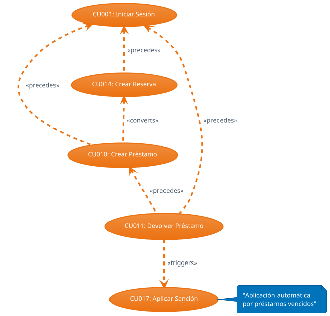

# CUADRO GENERAL DE CASOS DE USO
**SISTEMA DE GESTIÓN BIBLIOTECARIA - UNIVERSIDAD NACIONAL FEDERICO VILLARREAL**

---

## RESUMEN EJECUTIVO

El Sistema de Gestión Bibliotecaria UNFV está diseñado para automatizar y optimizar la gestión de recursos bibliográficos, préstamos, reservas y sanciones de la biblioteca universitaria. El sistema opera con tres actores principales y maneja 18 casos de uso fundamentales organizados en 6 módulos funcionales principales.

---

## IDENTIFICACIÓN DE ACTORES

### ACTOR 1: ADMINISTRADOR
**Descripción:** Personal autorizado de la biblioteca con permisos completos  
**Responsabilidades:**
- Gestión integral de usuarios del sistema
- Administración del catálogo de libros y ejemplares  
- Control de préstamos y devoluciones
- Supervisión de reservas y aprobaciones
- Gestión de sanciones y multas
- Generación de reportes y estadísticas
- Mantenimiento de datos maestros del sistema

**Características:**
- Acceso completo a todas las funcionalidades
- Capacidad de modificar/eliminar registros
- Responsable de la configuración del sistema
- Autorización para aplicar y levantar sanciones

### ACTOR 2: ESTUDIANTE  
**Descripción:** Usuario final del sistema con permisos limitados de consulta y autogestión  
**Responsabilidades:**
- Consulta del catálogo de libros disponibles
- Gestión de su perfil personal
- Creación y seguimiento de reservas
- Consulta de préstamos personales
- Revisión de sanciones aplicadas
- Autogestión de información académica

**Características:**
- Acceso restringido solo a funciones de consulta
- Puede ver únicamente su información personal
- No puede modificar datos de otros usuarios
- Capacidad limitada de autogestión

### ACTOR 3: SISTEMA
**Descripción:** Procesos automatizados que ejecutan tareas de forma autónoma  
**Responsabilidades:**
- Verificación automática de préstamos vencidos
- Aplicación automática de sanciones por atraso
- Cálculo de multas según reglamento  
- Actualización automática de estados
- Notificaciones automáticas a usuarios
- Mantenimiento de integridad de datos

**Características:**
- Ejecución basada en reglas de negocio
- Procesamiento en lotes programados
- Sin intervención manual requerida
- Garantiza consistencia del sistema

---

## DIAGRAMA GENERAL DE ACTORES

```plantuml
@startuml
!theme aws-orange

actor "Administrador" as admin #FFD700
actor "Estudiante" as student #87CEEB  
actor "Sistema" as system #98FB98

package "Sistema de Gestión Bibliotecaria UNFV" {
    
    package "Módulo de Autenticación" {
        usecase "CU001: Iniciar Sesión" as UC001
        usecase "CU002: Cerrar Sesión" as UC002
    }
    
    package "Módulo de Gestión de Usuarios" {
        usecase "CU003: Registrar Usuario" as UC003
        usecase "CU004: Modificar Usuario" as UC004
        usecase "CU005: Consultar Usuarios" as UC005
        usecase "CU006: Eliminar Usuario" as UC006
    }
    
    package "Módulo de Gestión de Libros" {
        usecase "CU007: Gestionar Libros" as UC007
        usecase "CU008: Gestionar Ejemplares" as UC008
        usecase "CU009: Consultar Catálogo" as UC009
    }
    
    package "Módulo de Gestión de Préstamos" {
        usecase "CU010: Crear Préstamo" as UC010
        usecase "CU011: Devolver Préstamo" as UC011
        usecase "CU012: Consultar Préstamos" as UC012
        usecase "CU013: Renovar Préstamo" as UC013
    }
    
    package "Módulo de Gestión de Reservas" {
        usecase "CU014: Crear Reserva" as UC014
        usecase "CU015: Gestionar Reservas" as UC015
        usecase "CU016: Consultar Reservas" as UC016
    }
    
    package "Módulo de Gestión de Sanciones" {
        usecase "CU017: Aplicar Sanción" as UC017
        usecase "CU018: Consultar Sanciones" as UC018
    }
    
    package "Módulo de Reportes" {
        usecase "CU019: Generar Reportes" as UC019
    }
    
    package "Módulo Personal Estudiante" {
        usecase "CU020: Gestionar Perfil" as UC020
    }
}

' Relaciones Administrador
admin --> UC001
admin --> UC002
admin --> UC003
admin --> UC004
admin --> UC005
admin --> UC006
admin --> UC007
admin --> UC008
admin --> UC009
admin --> UC010
admin --> UC011
admin --> UC012
admin --> UC013
admin --> UC015
admin --> UC016
admin --> UC017
admin --> UC018
admin --> UC019

' Relaciones Estudiante
student --> UC001
student --> UC002
student --> UC009
student --> UC012
student --> UC013
student --> UC014
student --> UC016
student --> UC018
student --> UC020

' Relaciones Sistema
system --> UC017

@enduml
```

---

## MATRIZ DE CASOS DE USO POR ACTOR

| ID | Caso de Uso | Administrador | Estudiante | Sistema | Prioridad | Estado |
|----|-------------|---------------|------------|---------|-----------|---------|
| CU001 | Iniciar Sesión | ✅ | ✅ | - | Alta | ✅ |
| CU002 | Cerrar Sesión | ✅ | ✅ | - | Alta | ✅ |
| CU003 | Registrar Usuario | ✅ | - | - | Alta | ✅ |
| CU004 | Modificar Usuario | ✅ | - | - | Alta | ✅ |
| CU005 | Consultar Usuarios | ✅ | - | - | Media | ✅ |
| CU006 | Eliminar Usuario | ✅ | - | - | Media | ✅ |
| CU007 | Gestionar Libros | ✅ | - | - | Alta | ✅ |
| CU008 | Gestionar Ejemplares | ✅ | - | - | Alta | ✅ |
| CU009 | Consultar Catálogo | ✅ | ✅ | - | Alta | ✅ |
| CU010 | Crear Préstamo | ✅ | - | - | Alta | ✅ |
| CU011 | Devolver Préstamo | ✅ | - | - | Alta | ✅ |
| CU012 | Consultar Préstamos | ✅ | ✅* | - | Alta | ✅ |
| CU013 | Renovar Préstamo | ✅ | ✅* | - | Media | ✅ |
| CU014 | Crear Reserva | - | ✅ | - | Media | ✅ |
| CU015 | Gestionar Reservas | ✅ | - | - | Media | ✅ |
| CU016 | Consultar Reservas | ✅ | ✅* | - | Media | ✅ |
| CU017 | Aplicar Sanción | ✅ | - | ✅ | Media | ✅ |
| CU018 | Consultar Sanciones | ✅ | ✅* | - | Media | ✅ |
| CU019 | Generar Reportes | ✅ | - | - | Media | ✅ |
| CU020 | Gestionar Perfil | - | ✅ | - | Baja | ✅ |

**Leyenda:**  
✅ = Acceso completo  
✅* = Acceso restringido a datos propios  
- = Sin acceso

---

## DESCRIPCIÓN DETALLADA POR MÓDULO

### MÓDULO 1: AUTENTICACIÓN Y AUTORIZACIÓN

**Objetivo:** Controlar el acceso seguro al sistema y establecer niveles de autorización

| Caso de Uso | Actor | Descripción Breve |
|-------------|-------|-------------------|
| **CU001: Iniciar Sesión** | Admin, Estudiante | Autenticación de usuarios mediante email/contraseña con redirección según rol |
| **CU002: Cerrar Sesión** | Admin, Estudiante | Terminación segura de sesión con invalidación de tokens |

### MÓDULO 2: GESTIÓN DE USUARIOS

**Objetivo:** Administrar usuarios del sistema (administradores y estudiantes)

| Caso de Uso | Actor | Descripción Breve |
|-------------|-------|-------------------|
| **CU003: Registrar Usuario** | Administrador | Crear nuevos usuarios con validación de datos únicos y asignación de roles |
| **CU004: Modificar Usuario** | Administrador | Editar información personal, académica y cambio de estados de usuarios |
| **CU005: Consultar Usuarios** | Administrador | Búsqueda y visualización de usuarios con filtros múltiples |
| **CU006: Eliminar Usuario** | Administrador | Eliminación lógica de usuarios con verificación de integridad |

### MÓDULO 3: GESTIÓN DE LIBROS

**Objetivo:** Administrar el catálogo de libros y control de ejemplares físicos

| Caso de Uso | Actor | Descripción Breve |
|-------------|-------|-------------------|
| **CU007: Gestionar Libros** | Administrador | CRUD completo de libros con gestión de autores y editoriales |
| **CU008: Gestionar Ejemplares** | Administrador | Control de ejemplares físicos, códigos únicos y estados |
| **CU009: Consultar Catálogo** | Admin, Estudiante | Búsqueda pública del catálogo con filtros y disponibilidad |

### MÓDULO 4: GESTIÓN DE PRÉSTAMOS  

**Objetivo:** Controlar el flujo de préstamos desde creación hasta devolución

| Caso de Uso | Actor | Descripción Breve |
|-------------|-------|-------------------|
| **CU010: Crear Préstamo** | Administrador | Registrar préstamos con validaciones de disponibilidad y sanciones |
| **CU011: Devolver Préstamo** | Administrador | Procesar devoluciones con cálculo de atrasos y multas automáticas |
| **CU012: Consultar Préstamos** | Admin, Estudiante | Visualización de préstamos (todos vs personales según rol) |
| **CU013: Renovar Préstamo** | Admin, Estudiante | Extensión de préstamos con validaciones de elegibilidad |

### MÓDULO 5: GESTIÓN DE RESERVAS

**Objetivo:** Manejar reservas de libros no disponibles con sistema de cola

| Caso de Uso | Actor | Descripción Breve |
|-------------|-------|-------------------|
| **CU014: Crear Reserva** | Estudiante | Solicitar reserva cuando no hay disponibilidad con verificaciones |
| **CU015: Gestionar Reservas** | Administrador | Aprobar/rechazar reservas y conversión a préstamos |
| **CU016: Consultar Reservas** | Admin, Estudiante | Visualización de reservas con estados y gestión de lista de espera |

### MÓDULO 6: GESTIÓN DE SANCIONES

**Objetivo:** Controlar sanciones automáticas y manuales por incumplimientos

| Caso de Uso | Actor | Descripción Breve |
|-------------|-------|-------------------|
| **CU017: Aplicar Sanción** | Admin, Sistema | Aplicación automática por atrasos y manual por otros motivos |
| **CU018: Consultar Sanciones** | Admin, Estudiante | Visualización de sanciones activas e históricas con cálculo de montos |

### MÓDULO 7: REPORTES Y ESTADÍSTICAS

**Objetivo:** Generar información estadística para toma de decisiones

| Caso de Uso | Actor | Descripción Breve |
|-------------|-------|-------------------|
| **CU019: Generar Reportes** | Administrador | Crear reportes de usuarios, préstamos, estadísticas y exportación |

### MÓDULO 8: PANEL PERSONAL

**Objetivo:** Autogestión de información personal para estudiantes

| Caso de Uso | Actor | Descripción Breve |
|-------------|-------|-------------------|
| **CU020: Gestionar Perfil** | Estudiante | Visualización y edición limitada de información personal |

---

## RELACIONES ENTRE CASOS DE USO

### DEPENDENCIAS FUNCIONALES

### FLUJOS PRINCIPALES DEL SISTEMA

**FLUJO 1: Gestión de Préstamo Completo**
1. CU001: Iniciar Sesión (Administrador)
2. CU009: Consultar Catálogo (verificar disponibilidad)  
3. CU010: Crear Préstamo (registrar préstamo)
4. [Tiempo de préstamo]
5. CU011: Devolver Préstamo (procesar devolución)
6. CU017: Aplicar Sanción (si hay atraso - automático)

**FLUJO 2: Gestión de Reserva con Conversión**
1. CU001: Iniciar Sesión (Estudiante)
2. CU009: Consultar Catálogo (no hay disponibilidad)
3. CU014: Crear Reserva (solicitar reserva)
4. CU015: Gestionar Reservas (Admin aprueba)
5. CU010: Crear Préstamo (conversión de reserva)

**FLUJO 3: Autogestión del Estudiante**
1. CU001: Iniciar Sesión (Estudiante)
2. CU020: Gestionar Perfil (ver información personal)
3. CU012: Consultar Préstamos (ver préstamos activos)
4. CU018: Consultar Sanciones (revisar multas)
5. CU016: Consultar Reservas (estado de reservas)

---

## MATRIZ DE COMPLEJIDAD

| Módulo | Casos de Uso | Complejidad Técnica | Complejidad de Negocio | Prioridad | Esfuerzo |
|--------|--------------|---------------------|------------------------|-----------|----------|
| Autenticación | 2 | Media | Baja | Alta | Bajo |
| Gestión Usuarios | 4 | Media | Media | Alta | Medio |
| Gestión Libros | 3 | Media | Media | Alta | Medio |
| Gestión Préstamos | 4 | Alta | Alta | Alta | Alto |
| Gestión Reservas | 3 | Media | Alta | Media | Medio |
| Gestión Sanciones | 2 | Media | Alta | Media | Medio |
| Reportes | 1 | Media | Baja | Media | Bajo |
| Panel Personal | 1 | Baja | Baja | Baja | Bajo |

---

## REGLAS DE NEGOCIO GLOBALES

### RN001: Control de Préstamos
- Máximo 3 préstamos simultáneos por usuario
- Duración estándar de préstamo: 7 días
- Máximo 2 renovaciones por préstamo
- Verificación obligatoria de ausencia de sanciones

### RN002: Sistema de Sanciones  
- Sanción automática por día de atraso: S/. 1.00
- Bloqueo automático de nuevos préstamos con sanciones activas
- Bloqueo de reservas para usuarios sancionados
- Levantamiento manual de sanciones por administrador

### RN003: Gestión de Reservas
- Solo disponible cuando no hay ejemplares disponibles
- Una reserva por libro por usuario
- Tiempo límite para confirmar reserva: 24 horas
- Lista de espera por orden cronológico (FIFO)

### RN004: Control de Acceso
- Sesión única por usuario
- Timeout automático: 30 minutos de inactividad
- Verificación de permisos en cada operación
- Separación estricta de datos por rol

---

## MÉTRICAS DEL SISTEMA

### Distribución por Actor
- **Administrador:** 15 casos de uso (75%)
- **Estudiante:** 9 casos de uso (45%)
- **Sistema:** 1 caso de uso (5%)

### Distribución por Prioridad  
- **Alta:** 9 casos de uso (45%)
- **Media:** 10 casos de uso (50%)
- **Baja:** 1 caso de uso (5%)

### Estado de Implementación
- **Implementado:** 20 casos de uso (100%)
- **En desarrollo:** 0 casos de uso (0%)
- **Pendiente:** 0 casos de uso (0%)

---

**Fecha de Elaboración:** Noviembre 2025  
**Versión del Documento:** 1.0  
**Estado:** Completo - Todos los CU Implementados