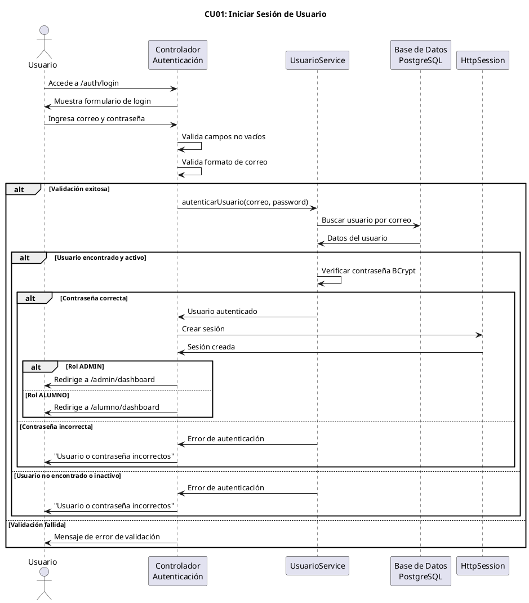
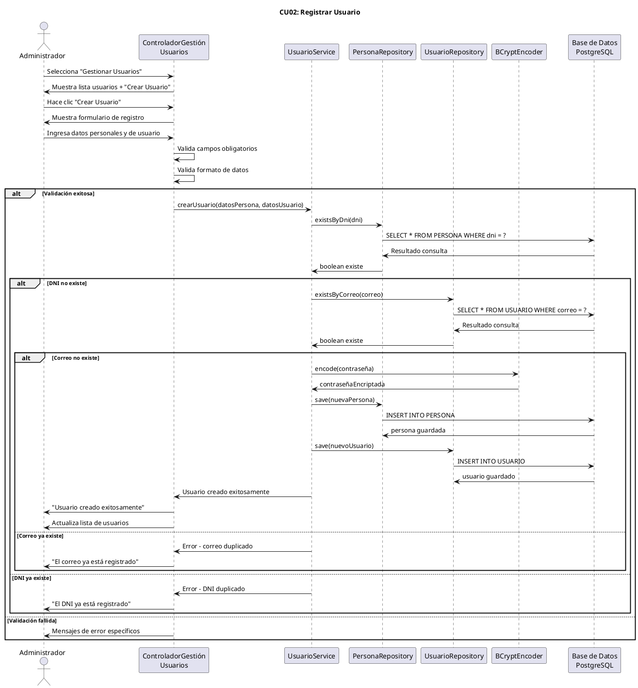
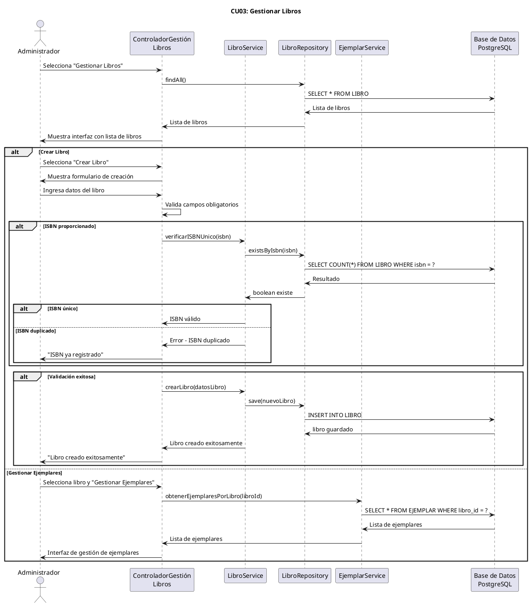
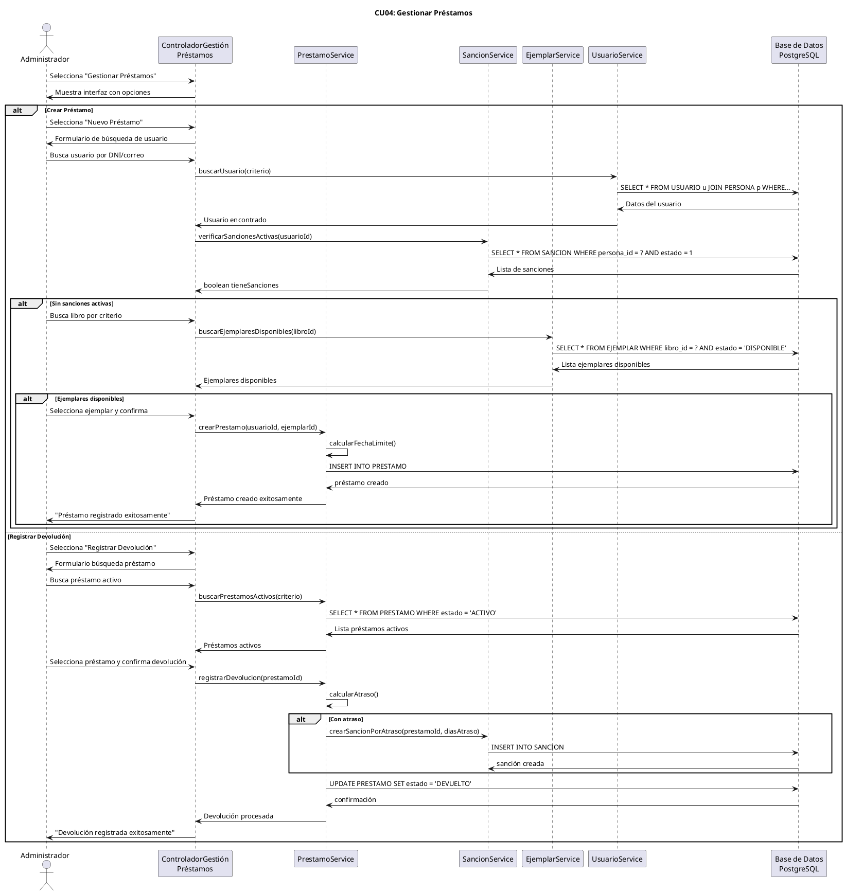
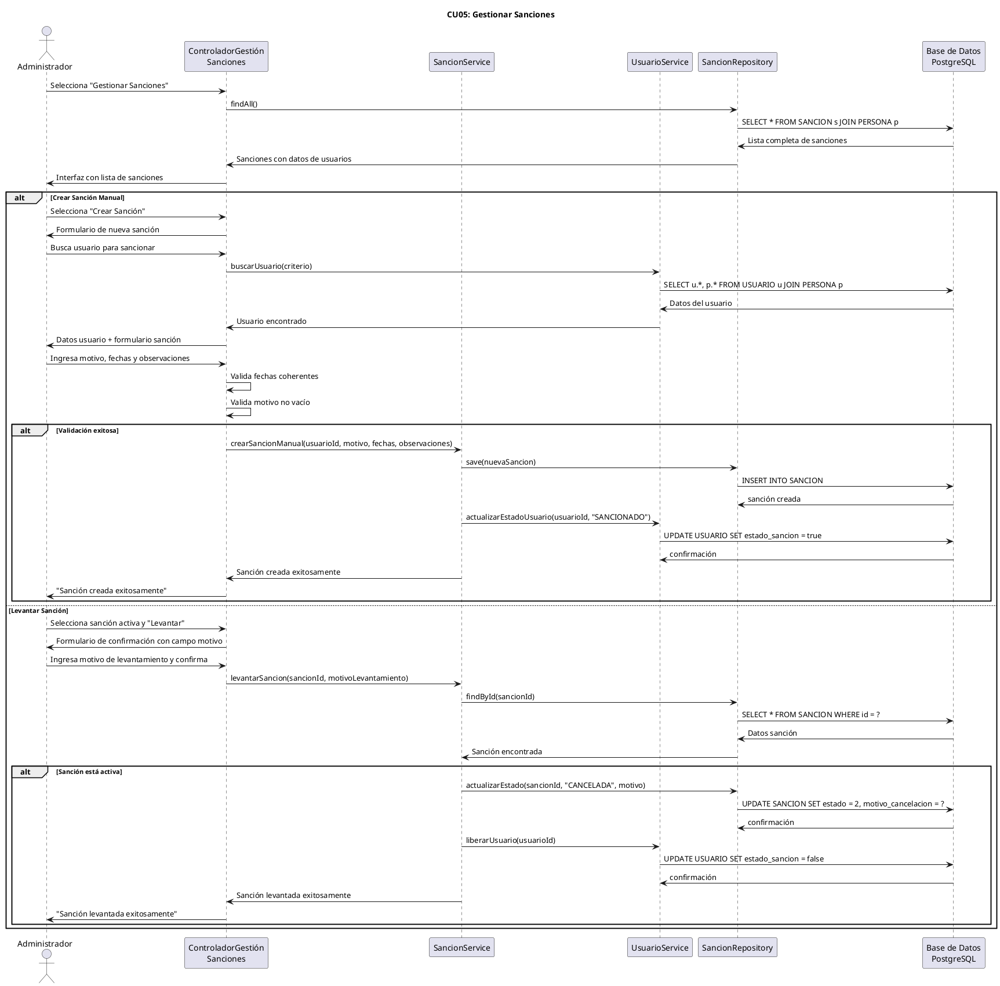
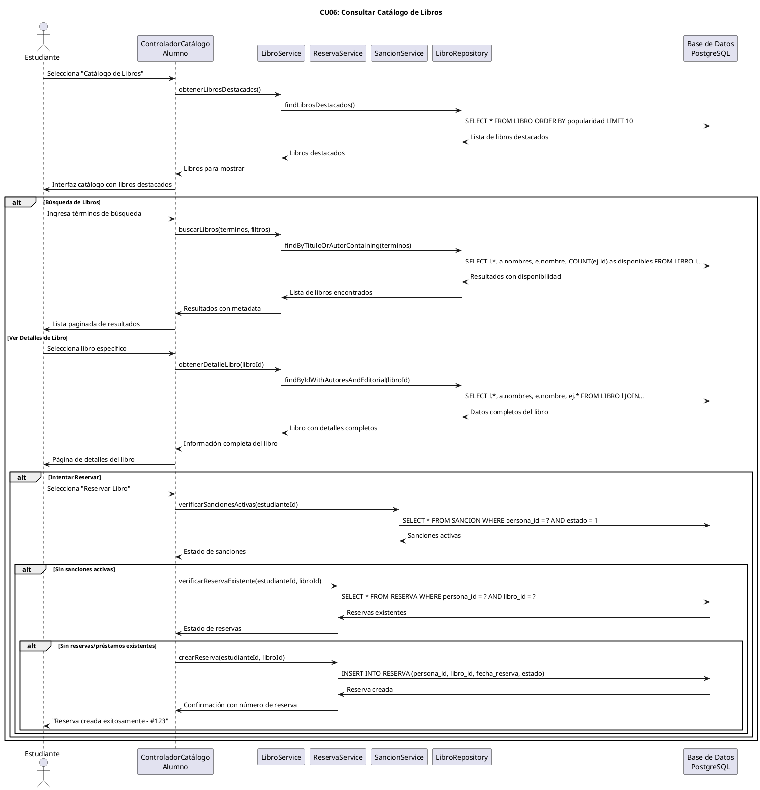
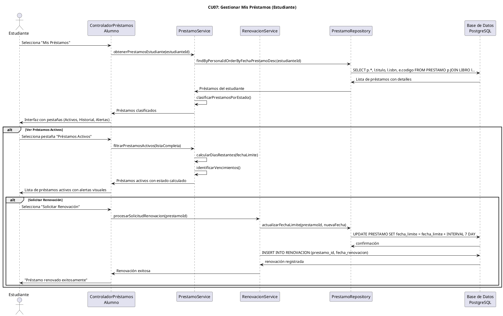
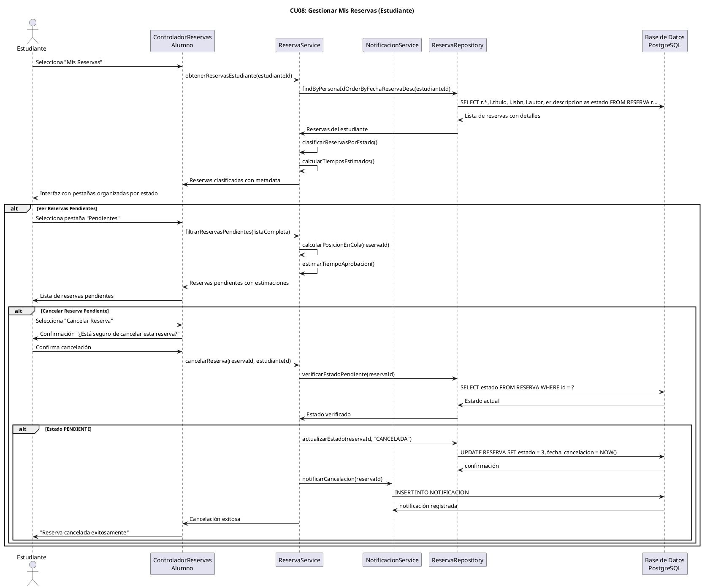
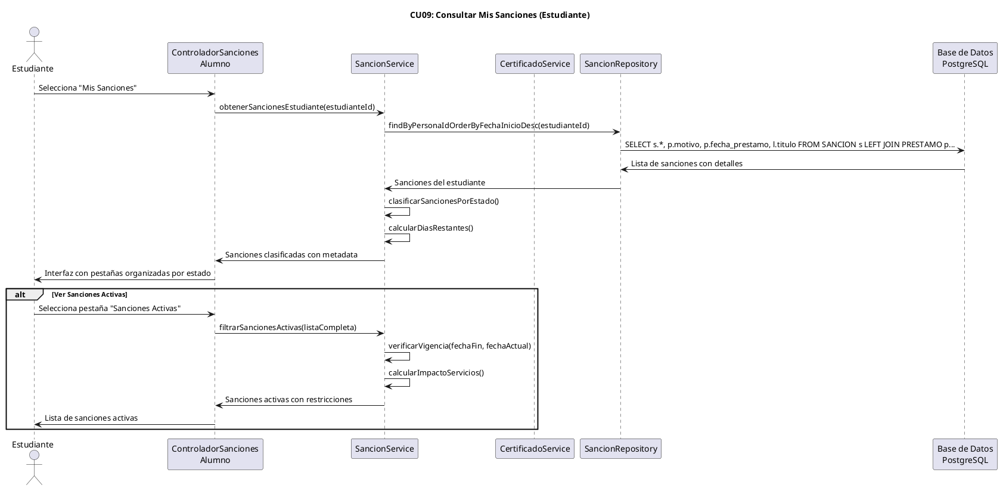
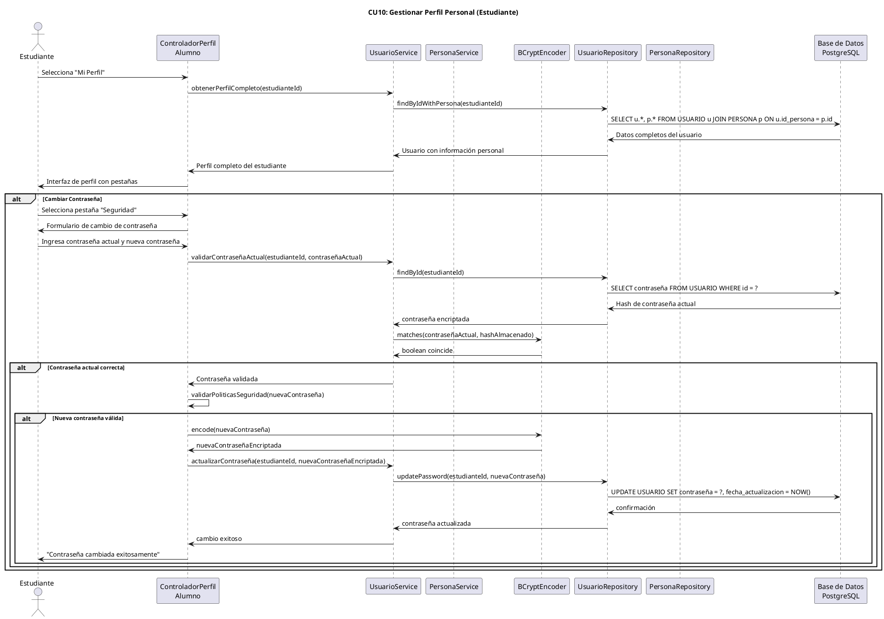

# Diagramas de Secuencia - Casos de Uso Principales

## CU01: Iniciar Sesión

## CU02: Registrar Usuario

## CU03: Gestionar Libros

## CU04: Gestionar Préstamos

## CU05: Gestionar Sanciones

## CU06: Consultar Catálogo de Libros

## CU07: Gestionar Mis Préstamos (Estudiante)

## CU08: Gestionar Mis Reservas (Estudiante)

## CU09: Consultar Mis Sanciones (Estudiante)

## CU10: Gestionar Perfil Personal (Estudiante)

---

**Nota:** Los diagramas de secuencia anteriores están listos para renderizar con PlantUML Online o servicios locales. Están embebidos en bloques de código markdown estándar.
